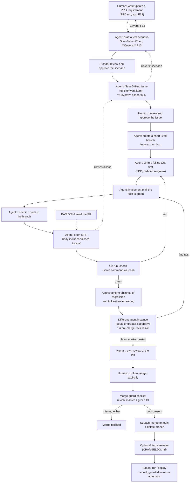

# spec-driven-guardrails

## What problem this solves

When you work with an AI coding agent, two things tend to go wrong once a
project grows past a toy size: the agent forgets what was decided and why,
and it merges things nobody reviewed. This repo is one person's (Ties')
answer to both, built up as a set of git/GitHub conventions plus a handful
of scripts and Claude Code skills that enforce them:

- **What was decided, and why, is written down before code exists** — a
  PRD as the normative spec, test scenarios that trace back to it, and an
  architecture doc for structural decisions — not left to chat history the
  next session won't have.
- **Nothing merges without a traceable link back to a scenario and a
  review** — mechanically checked, not just agreed on and then forgotten.

It's a personal workflow, not a product: the four projects that use it
today (this repo included) are Ties' own. It's shared here because the
conventions and scripts are the same across all of them, and duplicating
`CLAUDE.md` + `.claude/settings.json` per project caused them to drift.

## Who it's for, and who it's not

This is for **solo developers using an AI coding agent** who want the
agent's decisions to stay traceable and its merges to stay reviewed,
without hand-writing that discipline into every new project.

It is not:
- **An agent framework.** It doesn't run or orchestrate an agent — it's
  conventions plus guardrail scripts that an agent (Claude Code,
  specifically) is instructed to follow.
- **A replacement for your own process.** If your team already has a
  review and specification process, this doesn't sit alongside it — it's
  aimed at the gap that shows up when there isn't one, which is normal for
  a solo project.
- **A team tool, as shipped.** It's built and adopted for Ties' own solo
  projects; nothing here assumes a second human reviewer, and it isn't
  currently adopted into shared team/work repos (see `USER-CLAUDE.md`).

There's also a second reader this repo is useful to even without adopting
it: a **business analyst, product owner, or product manager** working with
a development team. In practice: given a feature branch's pull request,
they can trace backward through the enforced chain — the PR names the
GitHub issue it closes, that issue names the test scenarios it covers, and
each scenario is a Given/When/Then they can run directly as user
acceptance testing — without reading code, and without the surrounding
git/bash mechanics being the point.

## What you get if you adopt it

- A `CLAUDE.md` (this repo's `WORKFLOW.md`) that tells the agent the
  branch/PR/review discipline to follow every session, instead of you
  repeating it or the agent drifting.
- A `PRD.md` and `TEST-SCENARIOS.md` scaffold with fifteen non-functional
  questions already asked, so "what happens on failure" or "who can see
  this data" gets answered once, in writing, instead of being discovered
  later.
- A `pre-merge-review` skill and a merge guard that blocks `gh pr merge`
  without review evidence or green CI.
- A registry (`CHANGES.md`) of workflow changes a project can adopt or
  decline, one closed question at a time, instead of a big-bang migration.

## What it costs

Adopting this doesn't make the discipline free — it makes it checked:

- You still own the decisions: a PRD entry, a test scenario, or a
  non-functional answer can be agent-drafted, but nothing is accepted
  without your review and explicit approval — this repo checks the
  discipline, it doesn't remove you from the loop.
- You still request the merge and confirm it explicitly — this repo never
  merges on its own (see "Known limitations" below for why that isn't
  stronger).
- You still need `git` and the GitHub CLI (`gh`) installed and
  authenticated against your account before any of this works.

## Known limitations

Stated up front, not buried at the bottom — the value of this repo depends
on being honest about where it doesn't hold:

- **No server-side enforcement.** GitHub branch protection on a private
  repo requires a paid plan, so nothing here stops a direct push to `main`
  at the platform level — it's a workflow agreement the agent is
  instructed to follow, not a technical block.
- **The guardrails are machine-local.** The `PreToolUse` hook that blocks
  destructive git commands, and the merge guard, only exist on a machine
  after `adopt.sh` has run there. A fresh clone on a new machine doesn't
  have them until you set it up.
- **It's bash, and it's tied to Claude Code.** The scripts assume Bash 3.2
  compatibility and the skills are Claude Code skills specifically — this
  isn't provider-agnostic today (see `PRD.md`'s technical debt table for
  the deliberate boundary).
- **Review quality has a ceiling.** `pre-merge-review` raises the floor on
  what gets caught before a merge, but it's model-based review — it
  doesn't rule out the same kind of blind spot a human reviewer sharing
  the same training assumptions might also miss.

## Software development practices this project enforces

Each of these is backed by a concrete mechanism in this repo, not asserted
on its own:

- **Specification-Driven Development (SDD)** — `PRD.md` as the normative
  spec, broken down into epic/work-item GitHub issues before
  implementation starts.
- **Architecture Decision Records** — `ARCHITECTUUR.md` records structural
  decisions, alternatives considered, and the trigger to revisit them.
- **Non-functional requirements specification** — the `nfr/` register: one
  file per attribute (security, data integrity, failure modes, …), the
  single source for the NFR sections in every adopted `PRD.md`.
- **Test-Driven Development, red-before-green** — see the `tdd-seams`
  skill.
- **Trunk-based branching (GitHub Flow)** — short-lived branches off
  `main`, no long-lived parallel branches.
- **Automated testing** — unit tests, BDD-style Given/When/Then scenarios
  in `TEST-SCENARIOS.md`, and frozen-baseline regression tests (`test/fixtures/nulmeting/`).
- **Continuous Integration** — `check` runs identically locally and in CI;
  a merge is blocked while it's red.
- **Mandatory quality review before merge** — the `pre-merge-review` skill,
  enforced by the merge guard.
- **Requirements traceability** — an enforced chain from `PRD.md` to a test
  scenario to a GitHub issue to the merging PR (see `check-traceability.sh`).
- **Explicit technical debt tracking** — `PRD.md`'s technical debt table:
  what's accepted, why, and the trigger to address it.
- **Named refactoring triggers** — see the `refactoring-triggers` skill.
- **Disciplined bug diagnosis** — reproduction, hypotheses, a regression
  test, then the fix; see the `diagnose-bug` skill.

**Continuous Deployment is deliberately not practiced.** `deploy` stays a
manual, guarded command — it requires a clean working tree, green CI, and
runs against production only from `main` — by design, not because it was
never built.

## The workflow, visually



The dashed lines are the traceability chain read backward from a PR — the
path a business analyst, product owner, or product manager walks for the
UAT use case described above.

## Getting started

There are two independent paths from here, depending on who you are:

- **Trying this out or adopting it for your own project:** follow
  "One-time setup per machine" below, then "Adopting a project."
- **Just want to see the specification/traceability approach:** read
  `PRD.md` and `TEST-SCENARIOS.md` in this repo directly — they're real,
  filled-in examples, not templates. `templates/PRD.md` and
  `templates/TEST-SCENARIOS.md` are the blank versions.

The rest of this document is the complete developer reference — it's
self-contained: everything needed to install and adopt this workflow is
below, without needing anything above this point.

## Prerequisites

- `git`, installed and configured.
- The GitHub CLI (`gh`), installed and authenticated (`gh auth login`) —
  this repo's scripts and hooks call `gh` directly (e.g. to check PR
  status), so an unauthenticated `gh` will cause them to fail partway
  through rather than at the start.

## Contents

| File | Purpose |
|---|---|
| `WORKFLOW.md` | The workflow text itself (GitHub Flow, branch+PR, session steps, specification process) plus a routing table that points every moved topic to its skill. Symlinked as `CLAUDE.md` in adopted projects. |
| `settings/session-hooks.json` | `SessionStart`/`SessionEnd` hooks + `attribution.commit` setting. Symlinked as `.claude/settings.json`. |
| `hooks/` | `git-guardrails` — the `PreToolUse` guard against destructive git commands, and (W10b) the merge guard on `gh pr merge` without a review marker or with non-green CI. Always fails open (no `gh`/network, missing tool) — a broken guard must never block work. Invoked from `settings/session-hooks.json`. |
| `skills/` | The Claude Code skills (`pre-merge-review`, `deploy-guards`, `check-convention`, `adoption-registry`, `write-spec`, `refactoring-triggers`, `tdd-seams`, `diagnose-bug`, `adopt-workflow`) — see the routing table in `WORKFLOW.md`. `adopt.sh` symlinks each of them into `.claude/skills/` of every adopted project. |
| `USER-CLAUDE.md` | Short trigger instruction for the automatic adoption prompt on new projects. Symlinked as `~/.claude/CLAUDE.md`. |
| `templates/PRD.md`, `templates/TEST-SCENARIOS.md`, `templates/ARCHITECTUUR.md` | Generic templates for specifying a project (see the `write-spec` skill). The PRD requires answering fifteen non-functional questions and separates *Known limitations* from *Technical debt*; the test scenarios ask for failure paths alongside happy paths; `ARCHITECTUUR.md` records structural decisions and their revisit trigger. **Copied** on adoption, but only if the file doesn't already exist there — a filled-in copy is never overwritten. |
| `templates/ISSUE_TEMPLATE/` | GitHub issue templates (`epic.md`, `work-item.md`, `config.yml`), with notation aligned to `PRD.md`/`TEST-SCENARIOS.md`. **Copied** (refreshed) into `.github/ISSUE_TEMPLATE/` of the project on every adoption. |
| `templates/CONTEXT.md` | Optional glossary (project jargon → meaning), separate from `ARCHITECTUUR.md`, which covers structural decisions. Only scaffolded if the project answered `yes` to the `process-context-document` question (defined in `CHANGES.md`, answered in the project's own `WORKFLOW-ADOPTION.md`). |
| `templates/ci.yml` | Generic GitHub Actions CI that only calls `npm run check` (see the `check-convention` skill). Scaffolded on adoption, but only if the project has a `package.json`. |
| `CHANGES.md` | List of adoptable changes: per PR-sized change, a closed question, an "applies if" condition, and what "yes" means as a product default (not Ties' personal preference — see W37/#79). Projects record their answer in their own `WORKFLOW-ADOPTION.md` (or its pre-migration name, `WORKFLOW-ADOPTIE.md` — see W42/#114). |
| `CHANGES-ARCHIEF.md` | Retired `CHANGES.md` entries, with their ID unchanged so a project that once answered can still find where that row came from. |
| `nfr/` | The NFR registry: one file per non-functional attribute (security, data integrity, failure modes, …). The sole source for both the `spec-*` questions in `CHANGES.md` and the filled-in subsections in `templates/PRD.md` — neither is tracked separately anymore. |
| `lib/` | Shared bash libraries: `changes.sh` (the `CHANGES.md` parser and predicates, used by both `adopt.sh` and `pending-changes.sh`) and `nfr.sh` (reads/validates the `nfr/` registry). |
| `pending-changes.sh` | Determines which changes from `CHANGES.md` and `nfr/` apply to a project and are still unanswered. Invoked by the `SessionStart` hook. |
| `adopt.sh` | Script that creates/refreshes the symlinks and copies above locally, and seeds the adoption table of a new project. |
| `install.sh` | Pins a clone of this repo to a tagged release, for a consumer who doesn't want Ties' own always-follow-`main` usage (W37/#79). Run once after cloning; see "Installing a pinned version" below. |
| `check` | The only command this repo's own CI invokes: bash syntax, JSON validation, NFR registry drift, PR linkbacks, shellcheck (non-blocking), then the test suite. The same `check`/`deploy` naming convention this repo requires of adopted projects, applied here to itself. |
| `check-no-dutch.sh` | This repo's own translation-completeness check (W43/#115): scans for a curated list of untranslated-Dutch marker words outside the deliberate layer-C exclusions. |
| `check-traceability.sh` | The root copy of `templates/check-traceability.sh`, run directly against this repo's own `PRD.md`/`TEST-SCENARIOS.md` (this repo verifies its own traceability chain differently than adopted projects do — see `PRD.md`'s technical debt table). |
| `find-shared-vocabulary.sh` | Generates candidates for layer B (the shared-vocabulary tokens matched literally across the four adopted projects) — surfaces candidates, doesn't replace human curation. |
| `genereer-prd-blok` | Regenerates the NFR block inside `templates/PRD.md` from `nfr/`, so the two can't silently drift; `check` fails if the checked-in block doesn't match. |
| `ARCHITECTUUR.md` | This repo's own architecture-decision record, same purpose as `templates/ARCHITECTUUR.md` produces for an adopted project. |
| `CHANGELOG.md` | Release points: moments where a tag fixes the merge point as a human reference (see "Installing a pinned version" below). |
| `PRD.md`, `TEST-SCENARIOS.md`, `WORKFLOW-ADOPTION.md` | This repo's own filled-in copies of the templates above — self-adoption (#98/#102): this repo follows the same workflow it defines. |
| `test/` | This repo's own test suite: `run.sh` (runs everything under `cases/`), `lib.sh` (sandbox and assert helper functions), and `fixtures/nulmeting/` (the frozen baseline, see `LEESMIJ.md` there). |
| `PRD-MULTI-AGENT-WIP.md` | **WIP** — exploratory PRD for multi-agent software development in a later release, linked to epic [#65](https://github.com/TiesL/claude-workflow/issues/65). Not part of the shared workflow machinery above, and not approved: directional, with open design questions deliberately marked as **TBD**. |

## Why local symlinks instead of committed symlinks

Project directories aren't in the same place on every computer (e.g. `~/Projects` on one, `~/Documents/ClaudeCodeZandbak` on the other). A symlink you commit to git (relative or absolute) can therefore never be correct on both machines at once. That's why the symlinks are **not committed**: `adopt.sh` creates them locally, with a path that's correct per machine via the `SPEC_DRIVEN_GUARDRAILS_DIR` environment variable.

## One-time setup per machine (Ties' own use: always follow `main`)

1. Clone this repo anywhere you like on the machine.
2. Set once in your shell profile (`~/.zshrc` or `~/.bashrc`):
   ```bash
   export SPEC_DRIVEN_GUARDRAILS_DIR="/full/path/to/spec-driven-guardrails"
   ```
   Restart your shell (or `source ~/.zshrc`) so the variable is active.
3. Set up the user-wide adoption-prompt trigger:
   ```bash
   "$SPEC_DRIVEN_GUARDRAILS_DIR/adopt.sh" --user
   ```
   From now on, Claude Code will automatically ask, when starting a session in a not-yet-adopted git project, whether that project should use this workflow.

This checkout keeps following `main` — this is Ties' own, ongoing
multi-machine use. If you want a specific, pinned version instead
(see below), that setup replaces steps 1-2 above.

## Installing a pinned version (for a user other than Ties)

If you don't want to get every change on `main` live, but instead stay on a
specific, tagged release until you decide to upgrade:

1. Clone this repo (as above, step 1).
2. Run from that clone:
   ```bash
   ./install.sh          # pins to the latest tag
   ./install.sh <tag>     # pins to a specific tag
   ```
   `install.sh` refuses to run on a dirty working tree (uncommitted
   changes), and clearly reports which tag it picked or why a
   given tag doesn't exist.
3. Follow the instruction `install.sh` prints at the end: set
   `SPEC_DRIVEN_GUARDRAILS_DIR` to this clone in your shell profile (step 2
   above, unchanged), and optionally set the user-wide trigger (step 3
   above).

Upgrading to a newer release: run `install.sh <new-tag>` again
in the same clone. This is functionally equivalent to Ties' own setup — both
result in a checkout that `adopt.sh` works against the same way —
only this clone never follows `main` automatically.

## Adopting a project

Existing project:

```bash
cd /path/to/project
"$SPEC_DRIVEN_GUARDRAILS_DIR/adopt.sh"
```

New project: first `gh repo create <name> --private --source=. --remote=origin`
(see the `adopt-workflow` skill for the `git init` variant), then the same
`adopt.sh` step.

This sets `CLAUDE.md` and `.claude/settings.json` as local symlinks, and adds them to that project's `.gitignore` (they're machine-specific references, not project artifacts). Existing files at those paths — if they aren't symlinks — are renamed to `*.bak` instead of overwritten.

### Known pitfall: branches older than the adoption

Git overwrites a local (untracked) symlink without warning as soon as you switch to a branch that still has `CLAUDE.md`/`.claude/settings.json` as a regular, tracked file (e.g. a feature branch created before this project was adopted). After switching back to such a branch, the symlinks are gone. Solutions:
- **Preferred:** merge/rebase `main` into that branch once this project is adopted — after that, the conflict disappears permanently for that branch.
- **Alternative:** run `adopt.sh` again every time this happens (idempotent, no risk).

## Templates: copy instead of symlink

Unlike `CLAUDE.md`/`.claude/settings.json` (local symlinks,
never committed), the files under `templates/` are **copied** into
each adopted project, with two different behaviors:

- **`PRD.md`/`TEST-SCENARIOS.md`** — scaffold: only created if the
  file doesn't already exist in the project. These are project-owned,
  fillable documents; a filled-in copy is never overwritten.
- **`ISSUE_TEMPLATE/*`** — always refreshed on every `adopt.sh` run. This is
  meta-configuration (GitHub issue forms), not fillable content.

A symlink wouldn't work here anyway for the issue templates: GitHub renders
them server-side from the repo content itself, not via local
filesystem symlinks. Consequence of "copy": after a change to a
canonical template in this repo, `adopt.sh` must be run again in every
project to refresh the issue-template copy there (idempotent, no
risk — the same kind of agreement as the known pitfall above).

## Adoption registry

Every adopted project tracks in `WORKFLOW-ADOPTION.md` which changes from
`CHANGES.md` it applies. A `SessionStart` hook reports what's still open;
Claude poses those as closed yes/no choices and records the answer.
See the `adoption-registry` skill (reachable via the routing table in `WORKFLOW.md`) for the full story.

Manual checking is also possible:

```bash
"$SPEC_DRIVEN_GUARDRAILS_DIR/pending-changes.sh" /path/to/project
```

The hook locates this repo via the symlink
(`readlink .claude/settings.json`), not via an environment variable — a
non-interactive shell doesn't load your `~/.zshrc`, so a hook can't
rely on that. If that symlink points to a directory that no longer exists (e.g. after a
rename before re-adoption), the `SessionStart` hook reports that explicitly
instead of silently running no hooks.
