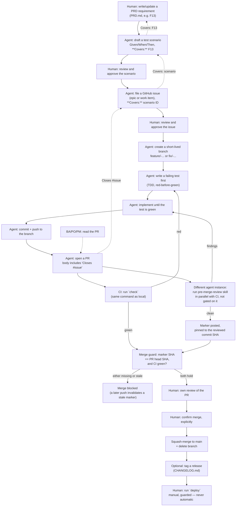

# spec-driven-guardrails

Guardrails for an AI coding agent working past toy-project size: what was decided stays
written down, and nothing merges without a traceable link back to a reviewed requirement.
Not an agent framework — conventions and scripts that Claude Code is instructed to follow.

**v0.2.0** (see `CHANGELOG.md`): the workflow itself now includes a five-role multi-agent
pipeline — this repo uses it to build itself, dogfood-only for now.

## The problem, and the shape of the fix

Two things go wrong once an AI agent works on a project long enough to matter: it forgets
what was decided and why, and it merges things nobody reviewed. `PRD.md` plus
`TEST-SCENARIOS.md` fix the first — nothing is "decided" until it's a spec entry a test
scenario traces back to. A mechanical merge guard fixes the second — `gh pr merge` is blocked
without a review marker pinned to the current commit and green CI. Both are enforced by
scripts, not by the agent remembering to follow a convention.

## How work actually moves


```mermaid
flowchart TD
    A["Human: write/update a PRD requirement\n(PRD.md, e.g. F13)"] --> B["Agent: draft a test scenario\nGiven/When/Then, **Covers:** F13"]
    B --> B2["Human: review and approve the scenario"]
    B2 --> C["Agent: file a GitHub issue\n(epic or work item), **Covers:** scenario ID"]
    C --> C2["Human: review and approve the issue"]
    C2 --> D["Agent: create a short-lived branch\nfeature/<issue#>-... or fix/<issue#>-..."]
    D --> E["Agent: write a failing test first\n(TDD, red-before-green)"]
    E --> F["Agent: implement until the test is green"]
    F --> G["Agent: commit + push to the branch"]
    G --> H["Agent: open a PR\nbody includes 'Closes #issue'"]
    H --> I["CI: run `check`\n(same command as local)"]
    H --> J["Different agent instance:\nrun pre-merge-review skill\nin parallel with CI, not gated on it"]
    I -->|red| E
    J -->|findings| F
    J -->|clean| J2["Marker posted,\npinned to the reviewed commit SHA"]
    I -->|green| M
    J2 --> M["Merge guard: marker SHA == PR head SHA,\nand CI green?"]
    M -->|either missing or stale| N["Merge blocked\n(a later push invalidates a stale marker)"]
    M -->|both hold| K["Human: own review of the PR"]
    K --> L["Human: confirm merge, explicitly"]
    L --> O["Squash-merge to main\n+ delete branch"]
    O --> P["Optional: tag a release\n(CHANGELOG.md)"]
    P --> Q["Human: run `deploy`\nmanual, guarded — never automatic"]

    H -.->|"Closes #issue"| C
    C -.->|"Covers: scenario"| B
    B -.->|"Covers: F13"| A
    S["BA/PO/PM: read the PR"] -.-> H
```

Review runs the moment the PR opens, in parallel with CI, not after it — a push after review
invalidates the marker by SHA, so nothing merges unreviewed. The dashed lines are the same
chain read backward: given a PR, a business analyst, product owner, or product manager can
trace it to the issue it closes, the scenario that issue covers, and the requirement that
scenario tests — a UAT trail, without reading code.

Everything below this point implements one stage of that diagram:

| Stage | Practice | Mechanism |
|---|---|---|
| Spec | Specification-Driven Development | `PRD.md`, broken into epic/work-item issues before code |
| Design | Architecture Decision Records | `ARCHITECTURE.md` — decisions, alternatives, revisit trigger |
| Design | Non-functional requirements | `nfr/` register — fifteen non-functional questions, one file per attribute, the source for every adopted `PRD.md` |
| Build | Test-first, red-before-green | `tdd-seams` skill |
| Build | Trunk-based branching | short-lived `feature/`/`fix/` branches, issue number required — sometimes via a release branch, below |
| Test | Automated testing | unit tests, `TEST-SCENARIOS.md`'s Given/When/Then, frozen-baseline regressions |
| CI | Continuous Integration | `check` — identical locally and in CI, blocks a red merge |
| Review | Mandatory quality review | `pre-merge-review` skill, enforced by the merge guard |
| Merge | Requirements traceability | PRD → scenario → issue → PR, checked by `check-traceability.sh` |
| Maintain | Technical debt tracking | `PRD.md`'s debt table — accepted, why, and the trigger to fix it |
| Maintain | Named refactoring triggers | `refactoring-triggers` skill |
| Maintain | Disciplined bug diagnosis | reproduce → hypothesize → regression test → fix; `diagnose-bug` skill |
| Deploy | *Not* continuous | `deploy` stays manual and guarded — by design, not an oversight |

## A third tier when one branch isn't enough

The diagram above is the common case: a feature/fix branch merges straight into `main`. For a
body of work spanning several work items — an epic — an optional **release branch**
(`release/<epic-number>-<slug>`, forked from `main`) sits between them: each work item's own
branch targets the release branch instead of `main` directly, and the release branch merges
into `main` as one deliberate step once the epic is actually ready.

The merge policy is asymmetric by design, not an oversight:

- **Work item → release branch**: merges on the executing session's own judgment, once
  review is clean and CI is green — no separate confirmation needed per work item.
- **Release branch → `main`**: always needs your explicit confirmation, exactly like any other
  merge into `main` — never automatic, regardless of how many work items already merged
  cleanly underneath it.

This lets an epic's individual work items land quickly while keeping the one decision that
actually matters — "is this epic ready to ship" — a single, deliberate act instead of an
accumulation of smaller ones nobody explicitly signed off on as a whole. `v0.2.0` itself was
built this way, on `release/295-multi-agent-workflow-v1`. The convention is still informal
(tracked as issue #309 — not yet written into `WORKFLOW.md` as a standing rule) but already
proven in practice.

## Building this repo with itself

Epic #295 made a second pipeline real: **Product** (right thing?), **Architect** (right way?),
**QA** (tested how?), **Fullstack Developer** (builds it end-to-end), **Reviewer** (independent
final gate) — the same five questions this repo already asks of any change, now run as five
actual role dispatches instead of one session wearing every hat. Conflict between roles
escalates; it doesn't get quietly resolved by whichever role speaks last.

Three mechanisms are real scripts today, not design prose:

- **`compliance-evidence.sh`** — renders a read-only evidence table for a PR from what already
  exists (model-record markers, review markers, CI, PR↔issue links).
- **`role-label-staleness.sh`** — flags an issue's `role:<name>` label once it's fallen behind
  the pipeline stage its own evidence shows.
- **`classify-review-depth.sh`** — classifies a PR `quick` or `thorough`, reusing Reviewer's
  own security-trigger categories rather than inventing a second taxonomy.

`wip/multi-agent-development/role-contracts/SKILL.md` gives each role a quotable contract —
responsibilities, write/action scope, Reviewer's security triggers. The full design record,
including OQ11 (the end-to-end pilot run that proved the pipeline actually works, resolved
2026-09-30) lives in `wip/multi-agent-development/`.

**Dogfood-only.** Nothing here ships to an adopted project yet — no `skills/` twin, no
`CHANGES.md` row. v0.2.0 is the proof it works on this repo; propagating it outward is a
separate, not-yet-taken step.

## Who it's for

Solo developers using an AI coding agent who want its decisions traceable and its merges
reviewed, without hand-writing that discipline into every new project. Also useful, without
adopting anything, to a BA/PO/PM who wants the UAT trail described above.

Not: an agent framework (it doesn't orchestrate anything, Claude Code does the work), a
replacement for a team's existing review process, or a team tool as shipped (built for
TiesL's own solo projects — see `USER-CLAUDE.md`). A Claude Code plugin conversion aiming at
non-engineer adoption is in progress (epic #282, `wip/claude-code-plugin/`) but not shipped.

## What it costs, and where it doesn't hold

Adopting this checks the discipline, it doesn't remove you from it: a PRD entry or test
scenario can be agent-drafted, but nothing is accepted without your review, and you confirm
every merge explicitly — this repo never merges on its own. `git` and an authenticated `gh`
are required before any of it works.

Stated up front rather than discovered later:

- **No server-side enforcement.** Branch protection needs a paid GitHub plan on a private
  repo; a direct push to `main` is a workflow agreement here, not a platform-level block
  (this repo itself is public, so it does have branch protection — see `CHANGELOG.md`).
- **Guardrails are machine-local** until `adopt.sh` runs there — a fresh clone doesn't have
  them yet.
- **Bash 3.2 and Claude Code specifically** — not provider-agnostic today (see `PRD.md`'s
  technical debt table).
- **Review has a ceiling.** `pre-merge-review` raises the floor; it's still model-based and
  can share a blind spot with the model that wrote the change.

## Getting started

Prerequisites: `git`, and the GitHub CLI (`gh`) installed and authenticated
(`gh auth login`) — scripts call `gh` directly and fail partway through, not up front, if it
isn't.

**Pin a specific release** (recommended for anyone who isn't TiesL):

```bash
git clone <this repo>
cd spec-driven-guardrails
./install.sh              # pins to the latest tag
```

Then set `SPEC_DRIVEN_GUARDRAILS_DIR` to that clone's path in your shell profile, and adopt a
project:

```bash
cd /path/to/your/project
"$SPEC_DRIVEN_GUARDRAILS_DIR/adopt.sh"
```

This symlinks `CLAUDE.md`/`.claude/settings.json` locally (never committed — paths differ per
machine, see below) and scaffolds `PRD.md`/`TEST-SCENARIOS.md`/issue templates if they don't
already exist. Re-run `adopt.sh` any time to refresh; it's idempotent.

Upgrading later: `./install.sh <new-tag>` in the same clone. To follow `main` live instead of
a pinned tag (TiesL's own usage, across multiple machines), skip `install.sh` and set
`SPEC_DRIVEN_GUARDRAILS_DIR` to a plain clone instead.

**Tracking what a project has and hasn't adopted:** `WORKFLOW-ADOPTION.md` in that project
records its answer to each entry in this repo's `CHANGES.md`; a `SessionStart` hook reports
what's still open. See the `adoption-registry` skill for the full mechanism.

## Reference

<details>
<summary>Full file-by-file contents (expand if you need it — most people don't)</summary>

| File | Purpose |
|---|---|
| `WORKFLOW.md` | The workflow text (branch/PR/session steps, spec process) plus a routing table to every skill. Symlinked as `CLAUDE.md`. |
| `settings/session-hooks.json` | `SessionStart`/`SessionEnd` hooks, `attribution.commit`. Symlinked as `.claude/settings.json`. |
| `hooks/` | `git-guardrails` — the `PreToolUse` guard against destructive git commands; the merge guard. Fails open on a broken environment. |
| `skills/` | Claude Code skills — see `WORKFLOW.md`'s routing table for the current list. Symlinked into `.claude/skills/` on adoption. |
| `USER-CLAUDE.md` | Trigger for the automatic per-machine adoption prompt. Symlinked as `~/.claude/CLAUDE.md`. |
| `templates/PRD.md`, `templates/TEST-SCENARIOS.md`, `templates/ARCHITECTURE.md` | Scaffolds (`write-spec` skill) — copied only if missing, never overwritten once filled in. |
| `templates/ISSUE_TEMPLATE/` | GitHub issue templates, refreshed every `adopt.sh` run (server-rendered, can't symlink). |
| `templates/CONTEXT.md` | Optional project-jargon glossary, scaffolded only if a project opts in. |
| `templates/ci.yml` | Generic CI calling `npm run check` (`check-convention` skill); scaffolded only where a `package.json` exists. |
| `CHANGES.md` / `CHANGES-ARCHIEF.md` | Adoptable workflow changes as closed yes/no questions, and their retired predecessors. |
| `nfr/` | Non-functional requirement registry — one file per attribute, source for `CHANGES.md`'s `spec-*` rows and every adopted `PRD.md`. |
| `lib/` | Shared bash: `changes.sh` (parser/predicates), `nfr.sh` (registry reader). |
| `pending-changes.sh` | What from `CHANGES.md`/`nfr/` still needs an answer in a given project. |
| `adopt.sh` / `install.sh` | Create/refresh local symlinks and scaffolds; pin a clone to a tagged release. |
| `check` | This repo's own CI entrypoint — syntax, JSON, NFR drift, PR linkbacks, shellcheck, tests. |
| `check-no-dutch.sh`, `check-traceability.sh`, `find-shared-vocabulary.sh`, `generate-prd-block` | This repo's own hygiene/consistency checks and generators. |
| `ARCHITECTURE.md`, `PRD.md`, `TEST-SCENARIOS.md`, `WORKFLOW-ADOPTION.md`, `CHANGELOG.md` | This repo's own filled-in copies — self-adoption: it follows the workflow it defines. |
| `test/` | This repo's own test suite (`run.sh`, `lib.sh`, `fixtures/baseline/`). |
| `wip/<slug>/` | Pre-decision elaboration for a new product/release (a "co-thinking session": Orchestrator + Product + Architect only). Directional until explicitly accepted, then promoted into a real epic; kept afterward as historical record. Live instances: `wip/multi-agent-development/` (epic #65/#295 — promoted, v0.2.0) and `wip/claude-code-plugin/` (epic #282). |

**Why symlinks are local, not committed:** project directories live in different places on
different machines, so a committed symlink (relative or absolute) can never be correct on
both — `adopt.sh` creates them locally via `SPEC_DRIVEN_GUARDRAILS_DIR`.

**Known pitfall:** switching to a branch older than a project's adoption silently overwrites
the local symlink with a tracked file of the same name. Fix: merge `main` into that branch
once (permanent), or just re-run `adopt.sh` (idempotent, no risk either way).

</details>
