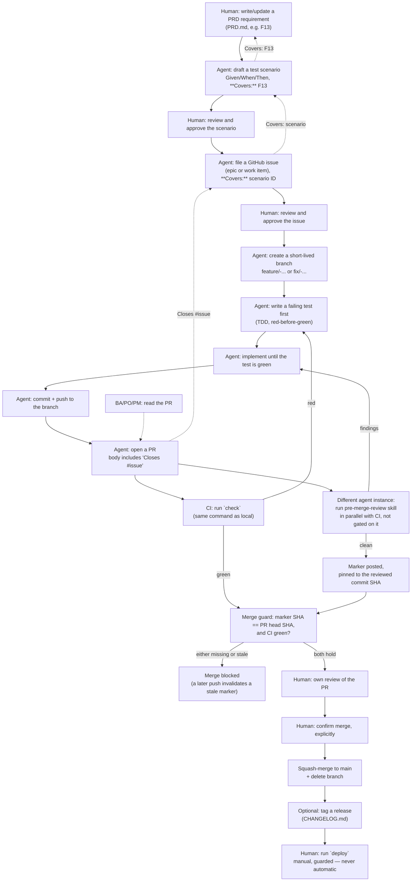

# spec-driven-guardrails

Guardrails for an AI coding agent working past toy-project size: what was decided stays
written down, and nothing merges without a traceable link back to a reviewed requirement.
Not an agent framework — conventions and scripts that Claude Code is instructed to follow.

**v0.2.0** (see `CHANGELOG.md`): this repo builds itself with a five-role multi-agent
pipeline, and an adopted project can opt into it — see
[How this repo builds itself](#how-this-repo-builds-itself).

## The problem, and the shape of the fix

Two things go wrong once an AI agent works on a project long enough to matter: it forgets
what was decided and why, and it merges things nobody reviewed. `PRD.md` plus
`TEST-SCENARIOS.md` fix the first — nothing is "decided" until it's a spec entry a test
scenario traces back to. A mechanical merge guard fixes the second — `gh pr merge` is blocked
without a review marker pinned to the current commit and green CI. Both are enforced by
scripts, not by the agent remembering to follow a convention.

## How work actually moves


```mermaid
flowchart TD
    A["Human: write/update a PRD requirement\n(PRD.md, e.g. F13)"] --> B["Agent: draft a test scenario\nGiven/When/Then, **Covers:** F13"]
    B --> B2["Human: review and approve the scenario"]
    B2 --> C["Agent: file a GitHub issue\n(epic or work item), **Covers:** scenario ID"]
    C --> C2["Human: review and approve the issue"]
    C2 --> D["Agent: create a short-lived branch\nfeature/<issue#>-... or fix/<issue#>-..."]
    D --> E["Agent: write a failing test first\n(TDD, red-before-green)"]
    E --> F["Agent: implement until the test is green"]
    F --> G["Agent: commit + push to the branch"]
    G --> H["Agent: open a PR\nbody includes 'Closes #issue'"]
    H --> I["CI: run `check`\n(same command as local)"]
    H --> J["Different agent instance:\nrun pre-merge-review skill\nin parallel with CI, not gated on it"]
    I -->|red| E
    J -->|findings| F
    J -->|clean| J2["Marker posted,\npinned to the reviewed commit SHA"]
    I -->|green| M
    J2 --> M["Merge guard: marker SHA == PR head SHA,\nand CI green?"]
    M -->|either missing or stale| N["Merge blocked\n(a later push invalidates a stale marker)"]
    M -->|both hold| K["Human: own review of the PR"]
    K --> L["Human: confirm merge, explicitly"]
    L --> O["Squash-merge to main\n+ delete branch"]
    O --> P["Optional: tag a release\n(CHANGELOG.md)"]
    P --> Q["Human: run `deploy`\nmanual, guarded — never automatic"]

    H -.->|"Closes #issue"| C
    C -.->|"Covers: scenario"| B
    B -.->|"Covers: F13"| A
    S["BA/PO/PM: read the PR"] -.-> H
```

Review runs the moment the PR opens, in parallel with CI, not after it — a push after review
invalidates the marker by SHA, so nothing merges unreviewed. The dashed lines are the same
chain read backward: given a PR, a business analyst, product owner, or product manager can
trace it to the issue it closes, the scenario that issue covers, and the requirement that
scenario tests — a UAT trail, without reading code.

Each stage of that diagram is backed by a concrete practice:

| Stage | Practice | Mechanism |
|---|---|---|
| Discovery | Structured requirement interviews | `grilling` skill — open questions as a design tree, numbered rounds, a recommended answer per question, stops only when the frontier is empty |
| Spec | Specification-Driven Development | `PRD.md`, broken into epic/work-item issues before code; the `write-spec` skill's `Covers:` token keeps a scenario linked to the requirement it tests |
| Design | Architecture Decision Records | `ARCHITECTURE.md` — decisions, alternatives, revisit trigger |
| Design | Non-functional requirements | `nfr/` register — fifteen non-functional questions, one file per attribute, the source for every adopted `PRD.md` |
| Design | Deep-module design | `codebase-design` skill — a shared vocabulary (Module, Interface, Seam, Depth, Leverage, Locality) plus two concrete tests (the deletion test, the two-adapters rule) for whether a decomposition is actually deep |
| Build | Test-first, red-before-green | `tdd-seams` skill |
| Build | Trunk-based branching (GitHub Flow) | short-lived `feature/`/`fix/` branches off `main`, issue number required in the name |
| Test | Automated testing | unit tests, `TEST-SCENARIOS.md`'s Given/When/Then, frozen-baseline regressions |
| CI | Continuous Integration | `check` — identical locally and in CI, blocks a red merge; the full gate; `pre-commit` runs only the project's declared, static `check-commit` (opt-in, 30 s budget, never the tests) |
| CI | Secret scanning | `gitleaks` in `pre-push` (blocking), with a CI backstop so a bypassed hook still gets caught |
| Review | Mandatory quality review | `pre-merge-review` skill, enforced by the merge guard |
| Review | Capability/cost-aware model selection | `model-choice` skill — which model/reasoning effort fits each pipeline stage, with a machine-readable `model-record` marker per stage |
| Merge | Requirements traceability | PRD → scenario → issue → PR: `check-traceability.sh` checks the first link offline; CI's `check-pr-issue-link.sh` refuses a PR that names no issue; `pre-merge-review` judges whether the links are the right ones |
| Maintain | Technical debt tracking | `PRD.md`'s debt table — accepted, why, and the trigger to fix it |
| Maintain | Named refactoring triggers | `refactoring-triggers` skill |
| Maintain | Disciplined bug diagnosis | reproduce → hypothesize → regression test → fix; `diagnose-bug` skill |
| Maintain | Verifiable adoption, not self-asserted | `adoption-registry` skill — a project's `WORKFLOW-ADOPTION.md` answers are checked mechanically where possible; a pending row blocks, and an unsubstantiated "yes" gets flagged |
| Deploy | *Not* continuous | `deploy` stays manual and guarded — a deliberate choice, not a gap |

## Who it's for

Solo developers using an AI coding agent who want its decisions traceable and its merges
reviewed, without hand-writing that discipline into every new project. Also useful, without
adopting anything, to a BA/PO/PM who wants the UAT trail described above.

Not a replacement for a team's existing review process, and not a team tool as shipped — it
was built for the author's own solo projects (see `USER-CLAUDE.md`). A Claude Code plugin
conversion aimed at non-engineer adoption is in progress (epic #282, `wip/claude-code-plugin/`)
but not shipped.

## What it costs, and where it doesn't hold

Adopting this enforces the discipline; it doesn't take you out of the loop. A PRD entry or
test scenario can be agent-drafted, but nothing is accepted without your review, and every
merge into `main` waits for your explicit confirmation — nothing reaches `main` on its own.

Stated up front rather than discovered later:

- **No server-side enforcement on a free private repo.** GitHub branch protection needs a paid
  plan for a private repository, so in a typical adopted project a direct push to `main` is
  stopped only on your own machine — by the `git-guardrails` hook and the native
  `pre-commit`/`pre-push` hooks — and caught after the fact by CI's `check-main-via-pr.sh`.
  This repo is the exception: it's public, and `main` has real branch protection (PRs
  required, `check` must pass, administrators included).
- **Guardrails are machine-local** until `adopt.sh` runs there — a fresh clone doesn't have
  them yet.
- **Bash 3.2 and Claude Code specifically** — not provider-agnostic today (see `PRD.md`'s
  technical debt table).
- **Review has a ceiling.** `pre-merge-review` raises the floor; it's still model-based and
  can share a blind spot with the model that wrote the change.

## Getting started

Prerequisites: `git`, and the GitHub CLI (`gh`) installed and authenticated
(`gh auth login`) — scripts call `gh` directly and fail partway through, not up front, if it
isn't.

**Pin a specific release** (recommended unless you want to follow `main` as it changes):

```bash
git clone <this repo>
cd spec-driven-guardrails
./install.sh              # pins to the latest tag
```

Then set `SPEC_DRIVEN_GUARDRAILS_DIR` to that clone's path in your shell profile, and adopt a
project:

```bash
cd /path/to/your/project
"$SPEC_DRIVEN_GUARDRAILS_DIR/adopt.sh"
```

This symlinks `CLAUDE.md`, `.claude/settings.json` and the skills into the project, installs
the native git hooks, and scaffolds `PRD.md`/`TEST-SCENARIOS.md`/issue templates if they don't
already exist. The symlinks are created locally and never committed: a project lives at a
different path on each machine, so no committed symlink, relative or absolute, could be right
on all of them. Re-run `adopt.sh` any time to refresh; it's idempotent.

Upgrading later: `./install.sh <new-tag>` in the same clone. To follow `main` live instead of
a pinned tag (the author's own setup, across multiple machines), skip `install.sh` and set
`SPEC_DRIVEN_GUARDRAILS_DIR` to a plain clone instead.

**Known pitfall:** checking out a branch that predates a project's adoption silently replaces
the local symlinks with tracked files of the same name. Fix it by merging `main` into that
branch once (permanent), or just re-run `adopt.sh` (idempotent, no risk either way).

**Tracking what a project has and hasn't adopted:** `WORKFLOW-ADOPTION.md` in that project
records its answer to each entry in this repo's `CHANGES.md`; a `SessionStart` hook reports
what's still open. See the `adoption-registry` skill for the full mechanism.

## How this repo builds itself

Everything above is what an adopted project gets: one agent session carrying a change through
every stage of the diagram, with a human at the approval points. This repo follows that
workflow too, and adds two practices on top. Both are opt-ins an adopted project is asked
about as well: the five-role pipeline (see "Adopting it" below) and the release-branch tier
(see "A release branch between work items and `main`" below).

### Five roles instead of one session

Since v0.2.0 (epic #295), a change to this repo is carried by five separately dispatched
agent roles rather than one session doing everything: **Product** (are we building the right
thing?), **Architect** (are we building it the right way?), **QA** (how will we know it
works?), **Fullstack Developer** (builds it, tests included), and **Reviewer** (independent
final gate). Each role gets a quotable contract — responsibilities, what it may write, and
Reviewer's security triggers — in the `role-contracts` skill (`skills/role-contracts/SKILL.md`).
When roles disagree, the conflict escalates to a human instead of being settled by whichever role
spoke last.

The dispatching itself is done by an orchestrating Claude Code session, so the "not an agent
framework" line at the top still holds: this repo supplies contracts, run rules and evidence,
not orchestrator software. Three read-only scripts provide the evidence:

- **`compliance-evidence.sh`** — renders an evidence table for a PR from what already exists
  (model-record markers, review markers, CI, PR↔issue links).
- **`role-label-staleness.sh`** — flags an issue's `role:<name>` label once it's fallen behind
  the pipeline stage its own evidence shows.
- **`classify-review-depth.sh`** — classifies a PR as needing a `quick` or `thorough` review,
  reusing Reviewer's own security-trigger categories rather than inventing a second taxonomy.

Which release this would land in was deliberately left as an open question in the design,
not to be answered until the pipeline had run end-to-end on a real work item. That run
happened on 2026-09-30 (#328, all five roles, with genuine findings caught and fixed at every
stage) and settled it: v0.2.0. The full design record lives in
`wip/multi-agent-development/`.

**Adopting it.** `adopt.sh` symlinks the `role-contracts` skill into every adopted project
like any other skill. Whether the project actually follows the pipeline is the opt-in
`process-multi-agent-roles` question in `CHANGES.md` (default: `question`, no general
preference): `pending-changes.sh` raises it, the `adoption-registry` skill handles the answer.
The skill is self-contained: it names the `role:<name>` labels and the `model-record` markers,
and points only at installed skills or built-in Claude Code skills (`security-review`,
`code-review`).

**Automatic from the first work item.** Once the row says yes, the `SessionStart` hook runs
`session-context.sh`, which prints the skill's `ORCHESTRATOR.md` into every session of that
project: what counts as a work item, the stage order with labels and markers, dispatching each
role as a fresh agent (never a fork), the human override record, what to do when dispatch
isn't available, and how to resume. So a session that gets a work-item request starts the
pipeline without being asked. A `no` or unanswered row prints nothing. This repo answers its
own row yes, with no special case. `session-context.sh` also warns when the project's
`CLAUDE.md` is no longer the link to `WORKFLOW.md`. Before merge, `model-record-gate.sh` flags a
run where one session played every role (several stages' markers in one text, or a stage
missing), and the merge guard refuses `gh pr merge` on it unless the human recorded a
`pipeline-override`. Without `gh` or network, both let the merge through.

What is mechanical and what isn't: the hook delivering the rules, the gate's finding and the
merge guard's refusal are tested. Whether a live session then *follows* the rules (starts the
pipeline unprompted, leaves a question alone, never nests a pipeline inside a role session,
stops and asks when it can't dispatch, resumes at the right stage) is model behaviour; only a
human dry run checks it, ideally followed by `model-record-gate.sh` on the dry run's PR. Checked
once on Claude Code 2.1.287 in headless mode (#371): `SessionStart` output reaches the
top-level session but not a freshly dispatched subagent, and the hook fires again on resume
and after compaction. A session that deliberately forges five separate stage comments is not
detected.

What an adopted project **gets**: the `role-contracts` skill, the opt-in question, the
session-start rules and the merge-time check once it answers yes, and permission to run the
three evidence scripts against its own repo. What it does **not** get: orchestrator software
(the orchestrating session is an ordinary Claude Code session following `ORCHESTRATOR.md`)
and any installed copy of the evidence scripts (`compliance-evidence.sh` and the other two). They are not installed into
the project and not wired into its `check` or CI, and they are read-only. Run them by path from
the guardrails clone, with the adopted
project's checkout as the working directory, so they address that project's repo:

```bash
"$SPEC_DRIVEN_GUARDRAILS_DIR/compliance-evidence.sh" <pr-number>
"$SPEC_DRIVEN_GUARDRAILS_DIR/role-label-staleness.sh" <issue-number>
"$SPEC_DRIVEN_GUARDRAILS_DIR/classify-review-depth.sh" <pr-number>
```

The gates assume this repo's conventions (`model-record` markers, the `pre-merge-review`
marker, `Covers:` links), so a project that did not adopt the related entries sees
`not-evidenced` rows. That is a correct report, not an error.

Prerequisites: the GitHub CLI (`gh`) installed and authenticated, `SPEC_DRIVEN_GUARDRAILS_DIR`
set to the clone (as for `adopt.sh`), and, if you want `role-label-staleness.sh` to say
anything, the five `role:<name>` labels created once in the project's own repo. The
`role-contracts` skill has the command to create the labels. In a checkout with several git
remotes (for example a fork plus `upstream`), run `gh repo set-default` first, or the scripts
may report on a different repo than you expect.

### A release branch between work items and `main`

In the diagram, a feature/fix branch merges straight into `main`. For an epic spanning several
work items, this repo and every adopted project can add an optional middle tier: a **release
branch** (`release/<epic-number>-<slug>`, forked from `main`). Each work item's branch targets the release branch, and the release branch
merges into `main` in one step once the whole epic is ready.

The full mechanism — when to open one, who may merge what into it, the frozen membership set,
the mandatory holistic review before the release branch can go to the maintainer, and the
version-bump proposal that merge carries — lives in the `release-branch-workflow` skill, not
repeated here. In short: the two merges are confirmed differently, on purpose. A work item
merges into the release branch on the executing session's own judgment once review is clean
and CI is green; the release branch merges into `main` only on the maintainer's explicit
confirmation, like every other merge into `main`, however many work items merged cleanly
underneath it. Individual work items land quickly, while the one decision that matters — is
this epic ready to ship? — stays a single, deliberate act. An adopted project is asked about
this tier (the `release-branch-workflow` question; its answer goes in `WORKFLOW-ADOPTION.md`)
and gets the `release-branch-workflow` skill installed.

`release/295-multi-agent-workflow-v1` (→ v0.2.0) ran this as an informal precedent (issue
#309) before the mechanism itself had a name or a skill. Epic #370 formalized it into what's
described above — and ran on its own release branch, `release/370-release-branch-workflow`,
dogfooding the mechanism it specifies.

## Reference

<details>
<summary>Where everything lives (expand if you need it — most people don't)</summary>

**What adoption installs into a project** — symlinked, so it stays current:

| File | Purpose |
|---|---|
| `WORKFLOW.md` | The workflow text (branch/PR/session steps, spec process) plus a routing table to every skill. Symlinked as `CLAUDE.md`. |
| `settings/session-hooks.json` | `SessionStart`/`SessionEnd` hooks, `attribution.commit`. Symlinked as `.claude/settings.json`. |
| `hooks/` | `git-guardrails` (the `PreToolUse` guard against destructive git commands, plus the merge guard; fails open on a broken environment), `push-after-commit`, and the native git hooks `pre-commit`/`pre-push`/`commit-msg`, which cover commits and pushes made outside Claude Code. |
| `skills/` | Claude Code skills — see `WORKFLOW.md`'s routing table for the current list. Symlinked into `.claude/skills/`. |
| `USER-CLAUDE.md` | Trigger for the per-machine adoption prompt. Symlinked as `~/.claude/CLAUDE.md`. |

**What adoption scaffolds into a project** — copied once, never overwritten once filled in:

| File | Purpose |
|---|---|
| `templates/PRD.md`, `templates/TEST-SCENARIOS.md`, `templates/ARCHITECTURE.md` | Spec scaffolds (`write-spec` skill). |
| `templates/check-traceability.sh` | Link 1 of the traceability chain: every requirement has a scenario, every `Covers:` reference resolves. Offline. |
| `templates/ci.yml` | Generic GitHub Actions CI that runs the project's own `check` (`check-convention` skill), plus a secret scan; npm setup only if a `package.json` exists. Scaffolded only once the project has an executable `check`. |
| `templates/check-pr-issue-link.sh`, `templates/check-main-via-pr.sh`, `templates/wait-for-ci.sh` | Scaffolded alongside `ci.yml`: fail a PR that names no issue; detect a commit on `main` that didn't come through a PR; wait for CI at a fixed cadence instead of polling by hand. |
| `templates/CONTEXT.md` | Optional project-jargon glossary, only if the project opts in. |
| `templates/ISSUE_TEMPLATE/` | GitHub issue templates — the exception: refreshed on every `adopt.sh` run (GitHub renders them server-side, so they can't be symlinked). |

**The machinery behind adoption:**

| File | Purpose |
|---|---|
| `adopt.sh` / `install.sh` | Create/refresh a project's local symlinks and scaffolds; pin a clone to a tagged release. |
| `CHANGES.md` / `CHANGES-ARCHIEF.md` | Adoptable workflow changes as closed yes/no questions, and their retired predecessors. |
| `nfr/` | Non-functional requirement registry — one file per attribute, source for `CHANGES.md`'s `spec-*` rows and every adopted `PRD.md`. |
| `lib/` | Shared bash: `changes.sh` (parser/predicates), `nfr.sh` (registry reader). |
| `pending-changes.sh` | What from `CHANGES.md`/`nfr/` still needs an answer in a given project. |
| `session-context.sh` | At session start: prints the session-context files (today `ORCHESTRATOR.md`) of entries a project answered yes, and warns when its `CLAUDE.md` link is gone. |

**This repo's own internals** — not installed anywhere else:

| File | Purpose |
|---|---|
| `check` | This repo's own CI entrypoint — syntax, JSON, NFR drift, PR linkbacks, shellcheck, tests. |
| `check-traceability.sh`, `wait-for-ci.sh` | This repo's own copies of the templates above. |
| `check-no-dutch.sh`, `check-no-quote-break.sh`, `check-no-sigpipe-race.sh`, `check-scenario-file-sync.sh` | Hygiene checks run from `check`, each guarding against a specific defect that happened here once. |
| `find-shared-vocabulary.sh`, `generate-prd-block` | Generators: shared-vocabulary candidates across adopted projects; the NFR block in `templates/PRD.md` from `nfr/`. |
| `epic-auto-close.sh` | Closes an epic from CI once every issue naming it is closed. |
| `compliance-evidence.sh`, `role-label-staleness.sh`, `classify-review-depth.sh` | The multi-agent evidence scripts described in [How this repo builds itself](#how-this-repo-builds-itself). |
| `ARCHITECTURE.md`, `PRD.md`, `TEST-SCENARIOS.md`, `CONTEXT.md`, `WORKFLOW-ADOPTION.md`, `CHANGELOG.md` | This repo's own filled-in copies — it adopts the workflow it defines. |
| `test/` | This repo's own test suite (`run.sh`, `lib.sh`, `cases/`, `fixtures/`). |
| `wip/<slug>/` | Thinking done before a decision, for a new product or release (a "co-thinking session": Orchestrator + Product + Architect only). Directional until explicitly accepted, then promoted into a real epic; kept afterward as a record. Examples: `wip/multi-agent-development/` (epics #65/#295, released as v0.2.0) and `wip/claude-code-plugin/` (epic #282). |

</details>
