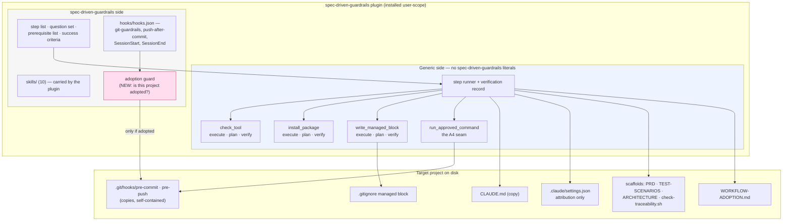
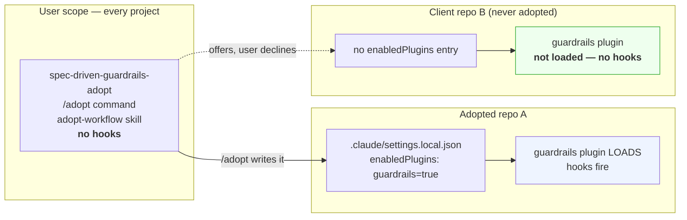

# Co-thinking report — Architect role (pass 2, independent)

Model/effort: Opus 5 (high effort), Architect role.

Subject: the `agentic-workflow-installer` proposal (v1 = turn
`spec-driven-guardrails` into one Claude Code plugin), as specified in
`wip/claude-code-plugin/PRD.md`, `ARCHITECTURE.md`, `TEST-SCENARIOS.md`,
building on `CO-THINKING-PRODUCT-REPORT-PASS2.md`. Pre-decision
elaboration only — nothing here commits anyone to build.

**Material read beyond the scoped input** (declared per A8; every item was
needed because a question the Product report handed me could not be
answered from the three design docs, which describe the code rather than
being it):

- `adopt.sh` (513 lines), `install.sh`, `settings/session-hooks.json`,
  `hooks/git-guardrails`, `hooks/pre-commit`, `hooks/pre-push`,
  `hooks/push-after-commit`, `hooks/rules.sh`, `hooks/read-command.py`,
  `USER-CLAUDE.md`, `check` — the Product report's handover questions 1, 2
  and 3 are all questions about what this code actually does and what a
  plugin can and cannot take over from it. Reading `adopt.sh` alone is not
  enough: the decisive facts are in the *hooks* and in
  `settings/session-hooks.json`, which neither design doc mentions.
- Official Claude Code plugin documentation, fetched live
  (`code.claude.com/docs/en/plugins-reference`, `/plugins/components`,
  `/plugins/create-marketplace`, `/plugins/host-marketplace`) — the
  proposal's whole v1 rests on what a plugin can carry, and both design
  docs assert that without citing it. Every plugin-mechanism claim below is
  quoted from those pages, not inferred.
- `claude --version` on this machine (2.1.280) and `gh repo view` on both
  repos (`spec-driven-guardrails` PUBLIC, `agentic-workflow-installer`
  PRIVATE) — for the version floor (Q11) and the distribution question (Q2).
- `vendor/codebase-design/SKILL.md` and `DEEPENING.md` — the decomposition
  vocabulary I am required to use.

---

## 1. Architecture soundness check

Short answer: **ARCHITECTURE.md's design satisfies PRD.md's *stated*
requirements and fails PRD.md's *implied* ones.** The gap is not
sloppiness — it is that both documents reason about the installer and
never about the thing installed. Six findings, ordered by how much they
change the build.

### 1.1 A5 is scoped to the installer; the payload is Bash-and-Python-only

PRD Portability names F1/F2 — "prerequisite detection and resolution … must
work correctly on macOS, Windows, and Linux". ARCHITECTURE A5's violation
signal is "a prerequisite check or fix that only runs under Bash/POSIX."
Both are about the *installer*.

What the installer installs, on the other hand:

- `hooks/git-guardrails` — 822 lines of Bash 3.2, and it hard-requires
  `python3`: `if ! command -v python3 >/dev/null 2>&1; then … exit 0`, plus
  four further inline `python3 -c` blocks and `hooks/read-command.py`.
- `hooks/pre-commit`, `hooks/pre-push`, `hooks/push-after-commit`,
  `hooks/rules.sh` — all `#!/usr/bin/env bash`.
- `templates/check-traceability.sh`, `check-pr-issue-link.sh`,
  `check-main-via-pr.sh` — all shell.

So a Windows adoption driven by a perfectly cross-platform installer
produces a project whose branch protection, merge guard, auto-push and
traceability check do not run. The installer would report seven green
criteria under F7 and the user would have nothing.

This is the single largest unproven assumption treated as settled. It is
not named as a risk anywhere in PRD.md or ARCHITECTURE.md, and it is
plausibly larger than F1–F7 combined. It needs to become an explicit
decision with three honest options: (a) v1 supports macOS/Linux only and
says so; (b) Windows support means WSL/Git-Bash as a *declared
prerequisite* (F1 detects it, F2 explains it); (c) the guardrails
themselves get reimplemented — a project several times the size of the
installer. My recommendation is (b), with (a) as the fallback: Git for
Windows ships Bash, and `git` is already a prerequisite, so the marginal
ask is small and honest. What must not happen is v1 claiming A5 while
shipping (a) silently.

### 1.2 The symlink is not only a freshness mechanism — it is the *resolution* mechanism

Both `adopt.sh`'s comments and the Product report frame symlinks as "always
the current version, not a snapshot." That is true and incomplete. Two
places use the symlink as a *pointer lookup*:

`settings/session-hooks.json`, every hook command:

```
p="${CLAUDE_PROJECT_DIR:-.}"; wf=$(dirname "$(dirname "$(readlink "$p/.claude/settings.json" 2>/dev/null)")"); …
```

`hooks/pre-commit`, lines 28–32:

```
target="$(readlink "${BASH_SOURCE[0]}" 2>/dev/null)"
if [ -z "$target" ]; then
  echo "warning: the pre-commit hook is no longer a symlink to claude-workflow — commit check skipped." >&2
  exit 0
fi
```

Consequence: **a copied `pre-commit` hook silently disables itself.** It
exits 0 with a warning most users will never see. So "copies instead of
symlinks on Windows" is not a placement-strategy change — it forces code
changes inside the hooks themselves (bake in an absolute path, or make the
hook self-contained by inlining `rules.sh`). That work is invisible in
every current estimate, and it is the same work whether or not Windows is
in scope, because of 1.3 below.

### 1.3 Under a plugin, the git hooks cannot be symlinks even on macOS

`${CLAUDE_PLUGIN_ROOT}` is documented as "Absolute path of the plugin's
installed version", with the explicit warning: "`${CLAUDE_PLUGIN_ROOT}`
changes when the plugin updates, so don't write state there."

A `.git/hooks/pre-commit` symlink into the plugin cache therefore dangles
the first time the plugin updates. `adopt.sh`'s own comment names exactly
this failure mode as the one it was written to eliminate: "a relative path
would make such a symlink dangling … and git silently skips a dangling git
hook, with no report at all. Exactly the failure mode F17 aims to
eliminate."

So the copy-vs-symlink decision is forced by the plugin mechanism itself,
independently of Windows. That simplifies Q4 considerably and is an
argument for deciding it once, uniformly, before any primitive is written.

### 1.4 Plugin hooks fire in every project — today's scoping disappears

Documented, unambiguous: "A plugin's hooks don't wait for one of the
plugin's skills or commands to be used. Claude Code registers them when a
session loads the plugin, and they fire on their events from then on."

Today, scoping is structural: `.claude/settings.json` is a per-project
symlink, so `git-guardrails`, `push-after-commit` and the SessionEnd
auto-push exist only in adopted projects. Move those hooks into
`hooks/hooks.json` in a user-scope plugin and they run **everywhere** —
including the work and team projects that Ties' own user-level `CLAUDE.md`
says explicitly must not receive this workflow unasked:

> Deze check is bewust *niet* stilzwijgend/automatisch afgedwongen — team-
> of werkprojecten die niet van Ties alleen zijn, horen deze workflow niet
> ongevraagd te krijgen.

The blast radius is not theoretical: the SessionEnd hook runs
`git push origin HEAD` on any non-`main` branch. Pushing an unrelated
client repo's branch because a plugin was installed is a genuine incident.

Neither PRD.md nor ARCHITECTURE.md mentions this. The plugin needs an
**adoption guard** — one module every plugin hook calls first, answering
"is `$CLAUDE_PROJECT_DIR` adopted?" from a marker on disk. That is new code
the plugin mechanism does not give you for free, and it partly offsets the
four functions the Product report correctly says the plugin deletes.

### 1.5 Three pieces of today's payload cannot be plugin content

Verified against the manifest reference and the components page:

| Today | Can the plugin carry it? | Evidence |
|---|---|---|
| Ten skills in `.claude/skills/` | **Yes** | Plugin `skills/` is first-class; installed user-scope, available everywhere |
| Hook definitions in `settings/session-hooks.json` | **Yes**, same JSON shape | "Save the plugin's hooks in `hooks/hooks.json` … in the same shape as the `hooks` object in `settings.json`. That lets you copy an existing settings hook in unchanged." |
| `attribution.commit: ""` in `.claude/settings.json` | **No** | Plugin `settings.json`: "Two keys take effect, `agent` and `subagentStatusLine`, and every other key is dropped." |
| `CLAUDE.md` → `WORKFLOW.md` | **No** | "Claude Code doesn't load a `CLAUDE.md` at the plugin root, and `claude plugin validate` warns `CLAUDE.md at the plugin root is not loaded as project context`." |
| `~/.claude/CLAUDE.md` → `USER-CLAUDE.md` | **No**, see §5 D1 | Same rule; a skill is loaded on description match, which is precisely what that file's rationale rejects |

So `.claude/settings.json` does not disappear under a plugin — it shrinks
to the attribution setting (and whatever permissions get added later), and
it still has to be written project-locally. Both design docs assume it
goes away with the hooks.

### 1.6 The primitive set, assessed as modules

ARCHITECTURE names "`check_tool`, `install_package`, `clone_repository`,
`copy_template`, `write_config`, `run_approved_command`, `assert` — 6-8
primitives, each with its own execution, plan/preview, and verification
logic." That is up to 21 functions plus a five-field state record, for a
payload of roughly ten file placements. Applying the deletion test and the
two-adapters rule to each:

| Primitive | Deletion test | Adapters that really vary | Verdict |
|---|---|---|---|
| `check_tool` | Complexity reappears at every caller (per-OS probing, version parsing) | macOS / Windows / Linux — three, real | **Deep. Keep.** |
| `install_package` | Same | brew / winget / apt — three, real | **Keep**, though Q6 may descope it to "explain and link" |
| `clone_repository` | Nothing reappears — v1 has **zero** callers; the plugin *is* the delivery mechanism that replaced the clone | none | **Delete from the set** |
| `copy_template` | Nothing reappears; it is `scaffold_if_missing`, a five-line pass-through over `cp` with one caller shape | one | **Shallow. Fold into the step definitions** |
| `write_config` | Complexity very much reappears — see below | one today, but the *behaviour* is deep | **Keep, renamed** |
| `run_approved_command` | This is the only place A4 can be enforced; without it "no unexplained execution" is a property of every caller | one production adapter, one recording/test adapter | **Keep — it is the A4 seam** |
| `assert` | This is F7, not a peer of the others | — | **Not a primitive; it is the verify mode** |

`write_config` deserves its own note. The Product report calls the payload
"roughly ten idempotent file placements … all of which complete in under a
second." Nine of them are. The tenth, `write_gitignore_block`, is 85 lines
of `awk` guarding a documented catastrophic failure ("A block with only a
begin marker let an earlier version silently erase everything after it")
and protecting real data ("`tennis-admin/.gitignore` excludes two nested
git repos … accidentally swallowing those turns two whole repos into
untracked content"). That is a genuinely deep module: a small interface
(`write_managed_block(file, begin, end, lines)`) over a lot of hard-won
behaviour, with high Locality — the marker-corruption bug is fixed in one
place for every caller and every project. It should be lifted as a
primitive on its own merits, and it is the one payload item where a casual
cross-platform reimplementation will lose correctness.

So: four primitives with real seams (`check_tool`, `install_package`,
`write_managed_block`, `run_approved_command`), each with execute/plan/
verify, plus a step list that is plain data. That is a smaller and deeper
set than 6–8, and it survives the two-adapters rule without appealing to a
second consuming project that does not exist.

### 1.7 What the split actually looks like



The three things this picture makes visible that the current documents do
not: the adoption guard is new work, `.claude/settings.json` survives, and
the git hooks are copies rather than links into the plugin.

---

## 2. Direct answers to the Product report's "Handover to Architect"

### 2.1 — How much of `adopt.sh` the plugin mechanism simply deletes

**Largely confirmed, with two corrections that matter.**

Confirmed deletions: `install_skills`, `skill_symlink_update`,
`skill_symlink_cleanup_if_orphaned`, `install_user_skill` all go. Plugin
skills load from `skills/<name>/SKILL.md` in the plugin, so there is no
project-local skills directory to maintain, no orphan class, and the
`.claude/skills/` line leaves the managed `.gitignore` block. The Product
report's payload estimate (~10 placements plus `seed_adoption_table`) is
right in magnitude.

Correction 1 — it is a **scope widening**, not parity. Today skills are
installed per project; a user-scope plugin makes all ten available in every
project, namespaced `/spec-driven-guardrails:write-spec`. That is mostly
welcome, but combined with §1.4 it means the plugin's *hooks* also apply
everywhere, and that is not welcome. The four deleted functions were
carrying the scoping property for free. The adoption guard that replaces it
is new code — small, but it must exist before the hooks move.

Correction 2 — three payload items cannot move into the plugin at all
(§1.5): `attribution.commit`, project `CLAUDE.md`, and the user-level
trigger file.

**Effect on the ordering: none.** E2 stays feasible as its own epic and E3
does not need to merge into it. But E2 is not "nearly free": it carries the
adoption guard and the two propagation decisions, which is why I price it
as the largest of the small epics in §3.

### 2.2 — Windows symlink behaviour and the propagation semantics

**Confirmed, from Anthropic's own docs rather than inference.** The
marketplace hosting page, describing symlinks inside a plugin: "On Windows,
use `mklink /D` from an elevated Command Prompt or enable Developer Mode."

My recommendation goes further than Q4 in one respect and narrower in
another.

Further: **copies everywhere, all three OSes, uniformly** — and not
primarily because of Windows. §1.3 forces it on macOS too, because a
`.git/hooks` symlink into `${CLAUDE_PLUGIN_ROOT}` dangles on the next
plugin update and git skips a dangling hook in silence. Deciding it per-OS
would mean two placement mechanisms, two definitions of "adopted", and an
F7 that has to accept either a symlink or a copy at the same path —
doubling exactly the scenario (S7b, wrong symlink target) that already
exists.

Narrower: this decision has a *code* consequence, not only a semantics one.
Per §1.2, `pre-commit` fails open when it is not a symlink. Copies require
the hook to locate `rules.sh` some other way — bake the resolved absolute
path in at write time, or inline `rules.sh` into the generated hook. I
prefer inlining: it makes the installed hook self-contained, survives the
plugin moving, and removes one whole class of "the guard silently did
nothing."

Propagation semantics, stated plainly so they can go in the PRD:
plugin-carried content (skills, session hooks) tracks the plugin version;
project-local content (CLAUDE.md, hooks, scaffolds, gitignore block) is a
copy stamped with the plugin version it came from, refreshed by re-running
adoption. Agreed with Product that this must be settled before E3 — I would
settle it *in E2*, since E2 cannot be built without choosing.

### 2.3 — Does `${CLAUDE_PLUGIN_ROOT}` fully replace `SPEC_DRIVEN_GUARDRAILS_DIR`?

**Inside Claude Code: yes, completely. Outside it: no, and that is the part
that matters.**

The variable is documented as available in "Hook commands … anywhere in
`command` and `args`", MCP/LSP server configs, and in every hook process's
environment. That directly replaces the `readlink`-the-settings-symlink
trick in `settings/session-hooks.json` — the plugin's hooks know where they
live without any pointer on disk. It also removes the clone and the shell
profile edit: the plugin cache *is* the checkout.

What it does not reach: the native git hooks (`pre-commit`, `pre-push`) run
under `git`, not under Claude Code, and get no such variable. Same for
anyone running `./check` or `pending-changes.sh` from a terminal. Those
need either a baked-in absolute path or self-containment (§2.2). And the
variable "changes when the plugin updates", so a baked-in path pointing
into the cache expires.

**Verdict for the business case: the claim holds.** "Distribution collapses
to two commands" is true for everything the user does; the residue is one
generated-at-install-time file pair, not a user-visible step. I would not
discount E2's value on this.

### 2.4 — The plugin system's stability and version floor

Concrete answers rather than a shrug:

- This machine runs **2.1.280**.
- Everything v1 needs — `plugin.json`, `skills/`, `hooks/hooks.json`,
  `${CLAUDE_PLUGIN_ROOT}`, `plugin marketplace add`, `plugin install` — is
  long-established, with no version note attached in the current docs.
- The version-gated features I found are all things v1 does **not** need:
  `metadata` (v2.1.222+), `archive` plugin sources (v2.1.224+), entry-level
  `headersHelper` (v2.1.238+), automatic `renames` migration (v2.1.193+).
- Recommendation for Q11: declare the floor as the version E2 is built and
  tested against, record it in the PRD next to F1, and have F1 check it by
  parsing `claude --version`. Do not invent a lower floor you have not run.

One finding that changes a Product assumption materially: **background
auto-update is off by default.** "Background auto-update is off for your
marketplace until a user or admin turns it on … `marketplace.json` has no
field to turn it on." Users receive changes when they run
`/plugin marketplace update <name>`, or if they enable auto-update
themselves. See §5 D2 — this inverts the risk in Product §2.7.

Second finding, for Q11's "how you will find out when it changes under
you": pin the marketplace entry's `version`, or deliberately omit it so
users track commits. The docs are explicit that setting `version` and not
bumping it means users never receive your changes — a silent-staleness trap
worth one line in the PRD.

### 2.5 — The E3/E4 split (primitives, then preview+verification)

**Half agree, and the split should be re-cut rather than merged or kept.**

Product is right that preview and verification are a user-trust pair. But
the mechanical triad is per-primitive by ARCHITECTURE's own decision
("each with its own execution, plan/preview, and verification logic") and
by S5b's rule that a primitive without a plan function cannot ship.
Retrofitting a plan function into a shipped primitive means re-deriving and
re-testing that primitive's effects — genuinely more expensive than
building all three modes at once, because the plan function *is* a second
description of the same effect and writing it second invites drift.

So the line moves: **E3′ = the four primitives, each with execute/plan/
verify and tests against a fake filesystem** (mechanical, one epic);
**E4′ = the aggregate preview, the per-criterion pass/fail report, and the
refusal-to-preview-blind rule** (user-facing, one epic). Product's
trust-pair argument survives intact at the UX layer, which is where it was
really an argument about. My split is the same two epics with the seam in a
different place, and it costs less.

### 2.6 — E7 (resume state) last, and possibly cut

**Agree it goes last; sharpen the cut rather than defending five fields.**

Once each primitive owns `verify`, the state record's job collapses to
caching verification results so a resume does not re-verify everything.
Field by field:

- `started` — subsumed. If `verify` is authoritative, "did it start" tells
  you nothing `verify` does not tell you better. This is S6b's own insight
  taken to its conclusion.
- inputs hash — subsumed. Verification checks actual target state against
  the answers in hand; if the user answers differently, verification fails
  and the step re-runs, which is the desired behaviour without a hash.
- definitions hash / plugin version — **keep**, and this is the one that
  earns its place, precisely because updates are manual (§2.4): a user can
  easily be adopting with a plugin two versions behind the state their
  project recorded. Store the plugin version, not a hash of the step
  definitions — it is the thing a human can act on.
- `verified` + evidence — keep, one record per step.

Two fields, not five. That folds cleanly into E3′ and stops being its own
epic. What stays as a separate concern is a real progress marker for the
slow prerequisite phase (E6), exactly as Product argues.

### 2.7 — E6 (prerequisites) at priority 6

**Keep it at 6, and shrink it — one of its three prerequisites is in the
wrong place entirely.**

The docs on what users need to install a plugin from a git-hosted
marketplace: "`git`, and for a private repository the access described
under Grant access to a private marketplace." So **`git` must already be
present and working before the plugin can be installed at all.** F1 can
never usefully report git as missing on a machine that got the plugin from
a GitHub marketplace — S1b's premise is unreachable for git.

That is an architecture correction, not a scope preference: `git` belongs
on A6's side of the admission gate, alongside the Desktop app, in the
bootstrap manual. (The exception is an `archive`-sourced or URL-hosted
marketplace, which needs no git — worth one sentence in the PRD, not a
design branch.)

What genuinely remains inside the conversation: `gh` presence, `gh auth`
state, and the Claude Code version floor. That is a much smaller E6 —
which supports rather than undermines Product's priority-6 placement. A
clean machine is not blocked behind F2; it is blocked behind E1.

### 2.8 — Re-adoption / upgrade

**Agree it is the biggest unaddressed question, and I think it is cheaper
than Product fears — because the merge strategy already exists in
`adopt.sh`, unnamed.**

Every file `adopt.sh` places falls into exactly one of three classes, and
the class is currently implicit in *which function was called*:

1. **Plugin-owned, overwrite freely** — `CLAUDE.md`, `.claude/settings.json`,
   the git hooks. Today: `backup_if_real_file` then replace. A user edit
   here is not a thing to preserve; it is a thing to back up and report.
2. **Seed once, never overwrite** — `PRD.md`, `TEST-SCENARIOS.md`,
   `ARCHITECTURE.md`, `CONTEXT.md`, `check-traceability.sh`, CI files.
   Today: `scaffold_if_missing`. These become the user's content the moment
   they are written.
3. **Managed region inside a user-owned file** — the `.gitignore` block
   (begin/end markers) and `WORKFLOW-ADOPTION.md` (append-only rows, seeded
   once, never re-seeded: `[ -e "$target" ] && return 0`).

Make that class an explicit field on each step definition and re-adoption
is solved by construction: class 1 is idempotent-by-overwrite, class 2 is
idempotent-by-skip, class 3 is idempotent-by-marker. No merge engine, no
diff3, no conflict UI. The one genuinely new behaviour needed is a report:
"this scaffold is older than the current template, here is what changed" —
information, not automation.

Product is right that this interacts with Q4. Under symlinks, re-adoption
was safe by *construction* (the link either points at the current file or
it does not). Under copies it is safe only if the class field exists. That
is a real technical reason to promote this work, and I do so in §3.

### 2.9 — Identity and repository bootstrap

**Split it in two; the current "it belongs nowhere" is right, and so is the
instinct that one half is A6 and the other is not.**

Outside the plugin's honest reach, therefore E1 / A6: creating a GitHub
account (browser, email, 2FA — the plugin cannot and should not drive
this), and `git config user.name` / `user.email`, which needs an identity
decision no installer should make for someone.

Inside the plugin's reach, therefore a new F-item: `gh auth login` (already
correctly handled in PRD Security — the browser flow, triggered and waited
on), `git init` for a directory that is not yet a repository, and
`gh repo create` for a repository with no remote. All three are exactly
what `run_approved_command` exists for, all three are confirmable, all
three are reversible-by-not-doing-them.

Concretely I would add **F0 — establish a workable repository context**,
before F1, with four checks: repository exists, remote exists, identity
configured, `gh` authenticated. It is not A6: A6's violation signal is "any
manifest or core primitive that assumes responsibility for getting Claude
Code itself installed or authenticated", and none of these four do.
`adopt_project()`'s hard `exit 1` on a missing `.git` becomes F0's first
branch rather than a dead end.

### 2.10 — The generic/specific grep check

**Agree without reservation; it belongs in E2's definition of done.** I
would add two more of the same genre, since the `check` script already has
the pattern (`check-no-dutch.sh`, `check-no-quote-break.sh`,
`check-no-sigpipe-race.sh`, `check-traceability.sh` are all wired in the
same way):

1. `spec-driven-guardrails` literal in the generic side's files → fail.
   (ARCHITECTURE's own stated violation signal.)
2. A shell invocation anywhere outside `run_approved_command` → fail. This
   is what makes **A4 testable**, answering Product §1.7's "A4 has no test
   scenario" with a mechanical check rather than a scenario nobody can
   write.
3. `claude plugin validate` on the plugin directory → fail on error. Free,
   and it catches the `CLAUDE.md at the plugin root is not loaded as
   project context` warning that §1.5 depends on.

### 2.11 — The framing question Product asked me to price

> If your estimates show E2 is not meaningfully cheaper than E2+E3+E4
> together, that recommendation does not hold and Ties should hear that
> from you.

It holds. E2 alone is meaningfully cheaper — roughly a third of
E2+E3′+E4′ in design/architecture terms. But the reason is not the one
Product gives. The cheap part is not "the plugin mechanism supplies most of
it"; the cheap part is that E2 needs **no plan/verify triad and no state
model**, which is where the multiplication lives. E2's own irreducible
cost is the two things neither document has priced: the adoption guard
(§1.4) and the copy-vs-symlink code consequences (§1.2/§1.3). Those do not
get cheaper by adding E3′ and E4′, and they do not go away by skipping E2.

So: fund E1+E2, exactly as recommended — but budget E2 as the largest of
the small epics, not as a formality.

---

## 3. Proposed epic / work-item decomposition

Product's decomposition is the starting point and most of it survives. I
state a reason at every deviation. Effort is the **design/architecture
share only** (S / M / L, relative to each other) — Product decides
priority; this is only the effort input to that decision.

| # | Epic | Change from Product | Design effort |
|---|---|---|---|
| E1 | Bootstrap admission manual, tested against one real person | **Agree**, plus: absorbs `git` presence (§2.7) and GitHub-account + `git config` identity (§2.9) | S |
| E2 | `spec-driven-guardrails` as a thin plugin (no engine) | **Agree on position; expanded content** — adds the adoption guard, the settings/`CLAUDE.md` residue, and the propagation decision | **L** |
| E8′ | Step classes and re-adoption | **Promoted from 8 to 3** — technical reason below | S |
| E3′ | Four primitives, each execute/plan/verify | **Re-cut** — absorbs E4's per-primitive plan functions and E7's two surviving state fields | M |
| E4′ | Aggregate preview + verification report (user-facing) | **Re-cut** — the trust pair at the UX layer only | S |
| E5a | Propagation + placement decision | **Pulled out of E5 and into E2's decision set** | — |
| E5b | Windows/Linux execution of the *installer* | Was E5 | M |
| E5c | **Portability of the installed payload** (Bash 3.2 + python3) | **New** — §1.1; not in Product's list because it is invisible from the docs | **L, possibly XL** |
| E6′ | `gh` detection, `gh auth`, version floor, F0 repo bootstrap | **Shrunk** (git moves to E1) and **widened** (F0 joins it) | S |
| E7 | Resume state model | **Dissolved** into E3′ (two fields), plus a progress marker inside E6′ | — |
| E9 | Generic core extraction | **Agree** — deferred, trigger unmet | — |

**Deviations, each with its reason:**

**E2 expanded, not merely endorsed.** Product's E2 is "plugin.json, ten
skills, session hooks, one conversational entry point." Two items must join
it or E2 ships something unsafe: the adoption guard (§1.4 — without it the
plugin auto-pushes branches in unrelated repositories) and the propagation
decision (§1.3 — without it the git hooks dangle on the first plugin
update). Both are E2-blocking, not E5 concerns.

**E8′ promoted from 8 to 3.** Technical reason, not preference: under
symlinks, re-running adoption was safe by construction; under copies
(forced by §1.3) it is not. The first time the workflow changes after E2
ships, a naive re-run overwrites a user's filled-in `PRD.md`. The fix is
the three-class field from §2.8 — small, and it must exist before anything
else writes files repeatedly. Promoting it costs almost nothing and
removes a data-loss path.

**E3 and E4 re-cut rather than merged or left.** §2.5. Same two epics, seam
moved from "primitives | preview+verify" to "mechanical triad | user-facing
aggregate."

**E7 dissolved.** §2.6. Two fields inside E3′, plus one progress marker
inside E6′ where slowness actually lives. Nothing is lost; S6 and S6b
still have to pass, and S6b's insight is the reason the fields shrank.

**E5 split three ways.** Product's single E5 hides three different-sized
things: a decision (E5a, one paragraph, belongs in E2), a port of the
installer (E5b, moderate), and the portability of the thing installed
(E5c, potentially the largest item on this page). Keeping them as one epic
is what lets the largest risk in the proposal stay invisible.

**E6 shrunk and widened.** §2.7 and §2.9. `git` leaves for E1; F0's four
repository-context checks arrive.

**Where I agree without qualification:** E1 first, and its "done looks
like" (a transcript of every point where a real person stopped). E2 second.
E9 deferred on the trigger already written. Product's Q10 experiment —
watching one user work for an hour with `adopt.sh` — is the highest-value
thing on any list here and costs nothing; it should happen before E3′ is
funded, and it is the only evidence that would tell me whether E5c is worth
opening at all.

**Q12, re-ranked with effort in hand.** Product predicted two flips. One
half-happens and one does not. E5 does *not* move ahead of E3′ wholesale —
only its decision does, into E2. E1 and E2 **cannot** run in parallel in
the way Product hoped ("if E2 turns out to be nearly free"), because E2 is
not nearly free; but they are genuinely independent, so they can run
concurrently on effort grounds alone.

This is a **proposed** decomposition. §4 records where it disagrees with
Product's rather than resolving the disagreement away.

---

## 4. Points of genuine disagreement with the Product report

Quoting Product's own sentences first, per Decision 4 / A7.

### D1 — The user-level trigger cannot move into the plugin

Product, Q7:

> ➡️ Yes, in scope, and simplified: with the plugin installed, the only
> remaining user-level artifact is the `~/.claude/CLAUDE.md` trigger, and
> even that could move into the plugin.

It cannot, twice over. Mechanically, "Claude Code doesn't load a
`CLAUDE.md` at the plugin root, and `claude plugin validate` warns
`CLAUDE.md at the plugin root is not loaded as project context`." The only
plugin component that could carry that text is a skill, and a skill is
loaded when its description matches. That is exactly what the file itself
rejects, in Ties' own words:

> Precies dáárom staat de trigger hier onvoorwaardelijk, in het altijd
> geladen bestand, in plaats van alleen in een skill die pas laadt wanneer
> hij toevallig relevant lijkt.

My position: the `~/.claude/CLAUDE.md` symlink (or copy) stays a real
user-level step the plugin performs, with confirmation, because it writes
outside any project. Product's conclusion that the user-level path belongs
in v1 and needs a scenario is right and I endorse it; the simplification it
rests on is not available.

### D2 — The "plugin auto-updates" risk runs the other way

Product, §2.7:

> Nothing tests the definitions-hash case (plugin updated between runs —
> which, for a plugin that auto-updates, is a *likely* case, not an exotic
> one)

Background auto-update is **off by default**: "Background auto-update is
off for your marketplace until a user or admin turns it on … Without
auto-update, users receive your changes when they run
`/plugin marketplace update <name>`." And a plugin with a pinned `version`
that is not bumped never reaches users at all.

My position: the untested case is real but inverted. It is not "the plugin
changed under the user between runs"; it is "the user's plugin is months
behind the state their project recorded, and neither of them knows." The
scenario to write is a staleness scenario, and the field to store is the
plugin *version* rather than a hash (§2.6). This is also why I would not
lean on plugin updates as the sole propagation mechanism without telling
users, in the plugin's own narration, how to pull an update.

### D3 — Private-repo distribution is possible; it is the audience that makes it impossible

Product, §1.7 and Q2:

> A plugin distributed from a private repo cannot be installed by a third
> party.

As stated this is not true: marketplaces can be private, and the docs
describe exactly how ("for a private repository the access described under
Grant access to a private marketplace"; SSH key in `ssh-agent`, or a stored
HTTPS credential via `gh auth login && gh auth setup-git`).

What *is* true, and is the load-bearing part: those are precisely the
prerequisites this project's named audience does not have. "Users without a
git-host account can add a marketplace you serve as a `marketplace.json`
URL or from a shared directory, but they can install only the plugins whose
entry sources they can also reach."

My position: Product's answer (a) — plugin code in the public
`spec-driven-guardrails` — is correct and I endorse it. But the corrected
reasoning matters for a decision Product's version would foreclose:
`agentic-workflow-installer` staying private is not disqualifying for
Ties' own use or for a future collaborator with repo access. The choice is
about audience, not about a mechanical impossibility.

### D4 — Do not keep two placement mechanisms

Product, Q4:

> Keep `adopt.sh` and its symlink model unchanged for your own machines; do
> not try to make one mechanism serve both.

I disagree, and this is the sharpest disagreement in this report. Two
mechanisms means two definitions of "adopted" living side by side in four
existing projects. F7 would have to pass for a project whose `CLAUDE.md` is
a symlink *and* for one where it is a copy, at the same path — which
doubles the verification matrix for precisely the scenario S7b already
covers (a symlink pointing at the wrong target). Worse, the person running
both mechanisms is the same person, on the same four repos, from two
machines: the drift lands on Ties, not on a stranger.

My position: one mechanism. Copies for project-local content, plugin for
skills and session hooks, on every machine including the author's. If that
is too large a swing for v1, then say so explicitly and date it: mark
`adopt.sh` as the author-only legacy path with a stated retirement trigger
("retired once the plugin passes the enumerated parity criterion on all
four adopted projects"), rather than leaving two live mechanisms with no
plan. An undated "keep both" is how you get a third mechanism later.

### D5 — "Ten idempotent file placements" understates one of the ten

Product, §1.6:

> The payload it drives, after 1.5, is roughly ten idempotent file
> placements and one table seed, all of which complete in under a second
> against a local directory.

The count and the conclusion are right; the uniformity is not.
`write_gitignore_block` is 85 lines of `awk` with a marker-integrity guard
added after an earlier version "silently erase[d] everything after it",
protecting a file that in one real project excludes two nested git
repositories. It is the one item in the payload that is deep rather than
trivial, and the one where a breezy cross-platform reimplementation (no
`awk` on Windows without Git-Bash — see §1.1) loses correctness silently.

My position: this does not change Product's engine argument, which I
otherwise agree with entirely — the primitive/plan/verify apparatus is
disproportionate to the payload and §1.6 of my own report cuts it from 6–8
to four. It changes *which* primitive survives the cut, and it means "just
write the files" is the wrong instruction to hand an implementer for this
one step.

### Where I do not disagree, and want that on the record

Product §1.2's "necessary but not sufficient" reading of install friction
is, in my judgement, the most important paragraph in either report, and
nothing I found contradicts it. The technical facts in §1.1 above make it
worse, not better: the workflow being installed is not only conceptually
demanding for a non-engineer, it is mechanically Unix-shaped all the way
down. Q10's one-hour experiment would tell you more than any epic on this
page.

---

## 5. Summary for Ties

Three things I would want you to take from this that are not in the
Product report, because they are only visible in the code and the plugin
docs:

1. **The installer being cross-platform does not make the workflow
   cross-platform.** 822 lines of Bash plus a python3 dependency get
   installed. Decide this explicitly (E5c) — "Windows means WSL or Git
   Bash, declared as a prerequisite" is a good answer; silence is not.
2. **A user-scope plugin's hooks run in every project you open**,
   including the work repos your own user-level `CLAUDE.md` says must not
   get this workflow unasked — and one of those hooks pushes branches.
   The adoption guard is not optional, and it belongs in E2.
3. **The copy-vs-symlink question is already answered by the plugin
   mechanism**, not by Windows: `${CLAUDE_PLUGIN_ROOT}` moves on update and
   git skips a dangling hook in silence. So decide it once, in E2, and
   accept that `pre-commit` needs a code change either way — today it fails
   open the moment it stops being a symlink.

Everything else is a matter of sequencing, and on sequencing Product and I
mostly agree: E1 and E2, then evidence, then decide about the rest.

---
---

# Follow-up A — 2026-09-25: hook scoping, properly solved

*Appended as a separate, dated follow-up. It supersedes the "adoption
guard" remedy proposed in §1.4 and §2.1 above; those sections are left
unedited so the change of position is visible rather than silent. The
problem statement in §1.4 stands unchanged — only the fix changes.*

**Verdict: (a). A genuine native scoping mechanism exists, and it is a
close structural match to what `adopt.sh` does today.** Ties is right that
the marker-based adoption guard was a workaround; I was wrong to propose
it. The guard is demoted to unnecessary for scoping, and survives only as a
narrow backstop for one case named in A.5.

One correction to the premise I was given: **`hall-of-automata-cli` has not
solved this problem.** It is an example of the hazard, not of the remedy —
see A.1. I would rather say that plainly than let a false precedent carry
the decision.

## A.1 — What `hall-of-automata-cli` actually does

Installed at `~/.claude/plugins/cache/mockasort/hall-of-automata-cli/1.4.0/`,
enabled at user scope in `~/.claude/settings.json`
(`"hall-of-automata-cli@mockasort": true`).

It has exactly one hook, `hooks/hooks.json`:

```json
{ "hooks": { "PreToolUse": [ { "matcher": "Write|Edit|MultiEdit",
  "hooks": [ { "type": "command",
    "command": "bash ${CLAUDE_PLUGIN_ROOT}/hooks/scripts/guard-writes.sh",
    "timeout": 10 } ] } ] } }
```

`guard-writes.sh` is 28 lines. Its comment states its intent: "PreToolUse
hook: block writes outside `~/.hall/`." There is **no project scoping of
any kind** — no `CLAUDE_PROJECT_DIR` reference, no marker file, no session
mode check (I grepped the whole plugin for those). It is registered
user-wide and attempts to police *every* Write/Edit in *every* project on
this machine, which is precisely the failure mode §1.4 warns about, applied
to a much broader matcher than anything `spec-driven-guardrails` proposes.

Taken literally, that hook would block every file edit in every repository
Ties opens. It does not, for three independent reasons — all of them bugs:

1. **It reads the wrong field.** It parses `d.get('tool', '')`, but the
   PreToolUse payload's field is `tool_name`. (`hooks/git-guardrails` in
   this repo documents the right contract: "JSON on stdin with `tool_name`
   and `tool_input.command`".) `TOOL` is therefore always empty, the
   `case` falls to `*) exit 0`, and the guard allows everything. Verified
   empirically: with a real `{"tool_name":"Write",…}` payload it exits 0;
   only with a fabricated `{"tool":"Write",…}` payload does it block.
2. **It uses the wrong exit code.** Even when it does fire it `exit 1`, and
   the hooks reference is explicit: "Claude Code treats exit code 1 as a
   non-blocking error and proceeds with the action, even though 1 is the
   conventional Unix failure code. If your hook is meant to enforce a
   policy, use `exit 2`."
3. **It uses a GNU flag that macOS does not have.** `realpath -m` →
   `realpath: illegal option -- m` on this machine. The path comparison
   silently degrades to empty strings.

So the precedent points the other way: a competent third-party plugin put a
user-scope enforcement hook in front of every session, and the only thing
standing between Ties and a machine where Claude cannot edit any file is a
typo. That is the strongest possible argument for solving this
structurally rather than by convention inside a script.

**Unrelated but found while investigating, and worth acting on:**
`~/.claude/settings.json` carries a GitHub token in plaintext under `env`
(`GITHUB_PERSONAL_ACCESS_TOKEN`, a `gho_…` value). `env` entries are
exported into the environment of every hook process, so **every user-scope
plugin hook on this machine already receives that token** —
`guard-writes.sh` among them. That is the same scoping problem with a
credential attached. I'd rotate the token and move it to `gh auth` /
a credential helper rather than settings `env`.

## A.2 — The native mechanism: install scope

Plugins have three install scopes, documented under *Choose an install
scope*:

> * **User scope**: the plugin is enabled for you in every project on this
>   machine. The entry goes in `enabledPlugins` in `~/.claude/settings.json`.
> * **Project scope**: the plugin is enabled for everyone who works in this
>   repository. The entry goes in `.claude/settings.json`, which you commit.
> * **Local scope**: the plugin is enabled for you in this repository only.
>   The entry goes in `.claude/settings.local.json`.

And the resolution order, from *Find where a plugin is enabled* (lowest to
highest precedence): `--add-dir`, `user`, `project`, `local`, `flag`,
`managed` — "For each plugin id, the value that applies is the one from the
highest-precedence source that mentions the id."

This is not an approximation of today's mechanism; it is the same
mechanism. Today, scoping is "there is a `.claude/settings.json` in this
project, and it is a symlink to `settings/session-hooks.json`." Tomorrow it
is "there is an `enabledPlugins` entry for the guardrails plugin in this
project's `.claude/settings.local.json`." Same file, same per-project
confinement, same gitignore posture — except Claude Code owns the
bookkeeping instead of `adopt.sh`.

Two further facts that decide the design:

**Local scope also triggers the fetch.** From *Enabled in project settings
but not installed*: "Claude Code fetches a plugin with an external source
only when one of these sources sets it to `true`: Your user settings; A
`.claude/settings.local.json` that git doesn't track; The `--settings`
flag; Managed settings." So a local-scope install both downloads the plugin
and confines it. Project scope alone does not fetch — "When a plugin's only
`true` is in the project's `.claude/settings.json`, Claude Code doesn't
fetch it onto a machine where it isn't installed" — which matters for the
collaborator case (A.5).

**Local scope carries no trust restrictions.** Project-scope plugins load
"only after the same trust check that applies to project allow rules", with
MCP servers and background monitors further restricted; "Personal-scope
plugins have none of these restrictions."

## A.3 — The resulting architecture: two plugins, split by scope

The split is not invented for the plugin — it already exists in the repo,
between `USER-CLAUDE.md` + the `adopt-workflow` skill (user level, must
work in *not-yet-adopted* projects) and `WORKFLOW.md` + `session-hooks.json`
+ the nine other skills (project level, only where adopted). The two
plugins are that same line, drawn where Claude Code can enforce it.

| | `spec-driven-guardrails-adopt` | `spec-driven-guardrails` |
|---|---|---|
| Scope | **user** — every project | **local** (or project) — adopted repos only |
| Carries | the `/adopt` command, the `adopt-workflow` and `adoption-registry` skills | the other eight skills, `hooks/hooks.json` (git-guardrails, push-after-commit, SessionStart fetch + pending-changes, SessionEnd push), the primitives and scripts |
| Hooks | **none** | all of them |
| Risk in a client repo | none — it can only be invoked | never loaded there |

`/adopt`'s job, in the target repository, becomes: run the placement steps
(§2.8's three file classes), then
`claude plugin install spec-driven-guardrails@<marketplace> --scope local`.
De-adoption is `claude plugin uninstall … --scope local` plus removing the
placed files — which also answers Q8 far better than "document a manual
procedure."



The scoping property is now **structural**: a hook that is not loaded
cannot fire, and nothing inside the hook has to be correct for that to
hold. Contrast A.1, where the property depended on a script parsing JSON
correctly.

## A.4 — Weighing the alternative the coordinator proposed

The proposed alternative — plugin carries only skills and the command, and
`/adopt` writes *project-local hook files* the way `adopt.sh` does today —
also eliminates the scoping problem by construction. It is a reasonable
design and I considered it seriously. I prefer A.3, for four reasons:

1. **It re-creates the propagation problem the plugin was meant to solve.**
   Project-local hook JSON pointing at scripts is exactly today's
   arrangement, with its `readlink`-the-symlink resolution (§1.2) and its
   dangling-path failure (§1.3). A.3 lets the hooks keep
   `${CLAUDE_PLUGIN_ROOT}`, which is the one part of the plugin mechanism
   that is unambiguously better than what exists.
2. **The trade it asks for is real but lands on the wrong side.** For
   *hooks specifically*, auto-update is more valuable than for skills, not
   less: `git-guardrails` is a guard whose bug fixes must reach every
   adopted project (its own comment: "a false positive blocks work in four
   projects at once and reaches them without a re-adoption, because the
   hook configuration is symlinked"). A stale copy of a guard is a guard
   that is wrong everywhere until someone re-runs adoption.
3. **It gives up the uninstall story.** Plugin-carried hooks have a native
   removal path; hand-written hook files in `.claude/settings.json` do not.
4. **It does not actually avoid the split.** You still need something at
   user scope to offer adoption in a non-adopted project. So it is the same
   two-artifact design, with the second artifact hand-rolled.

The one thing it does better: it works without a marketplace at all. If
distribution ever has to run through "copy this folder", the alternative is
the fallback — worth one line in the PRD, not the primary design.

## A.5 — What remains, honestly

Local scope is not a total answer; three residues, all small and all
nameable:

1. **The collaborator case.** Project scope (`.claude/settings.json`,
   committed) reaches everyone who clones — but per A.2 it does not fetch
   on a machine where the plugin isn't installed; the collaborator sees
   `Plugin "<name>" is enabled in project settings but isn't installed
   here`. Given this repo's README ("a personal workflow, not a team
   tool, as shipped"), local scope is the right default, and project scope
   is a deliberate later choice with a documented prerequisite.
2. **Multi-root sessions.** `--add-dir` can bring a second repository into
   a session whose primary directory is adopted. The hooks load from the
   primary directory's scope and will see commands aimed at the added
   directory. For `git-guardrails` that is arguably correct (it guards the
   command, not the repo). For the **SessionEnd auto-push**, which runs
   `git -C "${CLAUDE_PROJECT_DIR:-.}" push`, it is already scoped to the
   project dir and stays correct. No action needed; worth one test
   scenario.
3. **The backstop.** I would keep a *single* cheap assertion — the
   SessionEnd push hook verifying that `$CLAUDE_PROJECT_DIR` is the repo it
   thinks it is — not as the scoping mechanism, but as defence in depth on
   the one hook with an irreversible side effect. That is one line, not an
   "adoption guard" in every hook.

## A.6 — Changes to the decomposition in §3

- **E2's scope changes, and shrinks.** "Adoption guard" is struck. In its
  place: split the plugin in two (A.3) and have `/adopt` perform a
  local-scope install. Net: less code than §3 assumed, and a structural
  guarantee instead of a conventional one.
- **§2.1's conclusion is amended.** I wrote there that the deleted
  functions "were carrying the scoping property for free" and that
  replacing it was new code. Half right: the property does have to be
  re-established, but by a `--scope local` flag rather than by code.
- **Q8 (de-adoption) gets easier** and should be re-answered: uninstall is
  native for the plugin half, and the three file classes (§2.8) already say
  what to remove for the rest.
- **The §5 summary's point 2 stands as a *risk*, and is now *solved*.**
  Left in place above so the reasoning chain is readable; this follow-up is
  the resolution.
