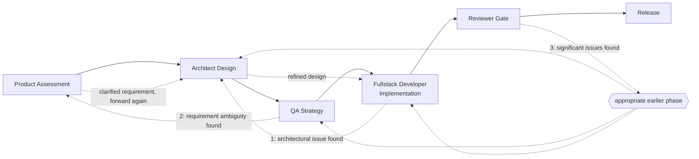

# Software Development Workflow Agents

> **Status: WIP exploration, part of epic [#65](https://github.com/TiesL/spec-driven-guardrails/issues/65).**
> Imported from another project's workflow and adapted to this project's principles —
> see [`PRD-MULTI-AGENT-WIP.md`](PRD-MULTI-AGENT-WIP.md) §4/§6 and
> [`ARCHITECTURE-MULTI-AGENT-WIP.md`](ARCHITECTURE-MULTI-AGENT-WIP.md) for the decisions
> that changed this document from its original import. Not an approved architecture.

## System Architecture Overview

**Pattern**: Meta-Agent Orchestrator + Specialized Sub-Agents

The system consists of:
- **1 Master Orchestrator Agent**: Active workflow coordinator and intelligent decision manager
- **5 Specialized Sub-Agents**: Product → Architect → QA → Fullstack Developer → Reviewer

This non-linear workflow allows looping back to earlier stages when new insights emerge. All five roles fully engage on every change, always — v1 has no phase skipping or scenario-based routing (see "Engagement: full, always" below).

---

## Meta-Orchestrator Agent

### Purpose

Serve as the intelligent workflow manager and active decision-maker. The Orchestrator coordinates all sub-agents, maintains shared context, manages handoffs between phases, and enables non-linear process flows (looping back to an earlier phase for rework) within defined guardrails.

### Core Responsibilities

#### 1. Workflow Routing & Coordination

- **Primary Path**: Routes work through the standard pipeline (Product → Architect → QA → Fullstack Developer → Reviewer)
- **Backward Loops**: Facilitates rerouting to earlier phases when new insights emerge
  - Fullstack Developer discovers architectural issue → route back to Architect
  - QA finds design flaw → route back to Product for requirement clarification
  - Reviewer identifies scope creep → route back to Product
- **Reconstructs context per phase from artifacts** (§ Shared Context Requirements below), not held as shared state
- **Manages handoffs** with full visibility of prior assessments, decisions, and findings

#### 2. Non-Linear Process Management

- **Engagement: full, always** — **decided (issue #281)**: all five roles (Product, Architect, QA, Fullstack Developer, Reviewer) fully engage on every change, regardless of type or urgency. No phase is ever skipped or abbreviated by the orchestrator; there is no scenario-based routing (security hotfix, refactor-only, spike, or otherwise) in v1. Each role's own agent judges internally how much depth a given change actually warrants within its own phase — that judgment stays inside the role, not encoded as an orchestrator rule. Scaling engagement back per scenario is deliberately deferred to a later version: modeling it now, before any real usage data, risks over-engineering the first release.

- **Looping Back (Encouraged)**
  - Encourages revisiting earlier phases when new insights emerge
  - Passes updated context to earlier agent for reconsideration
  - Earlier agent can revise decision based on new information
  - Updated decision flows forward again through pipeline
  - Example patterns:
    - "Realization is proving architectural assumptions invalid" → back to Architect
    - "Test results reveal requirement ambiguity" → back to Product
    - "Performance analysis suggests new optimization approach" → back to Architect
    
#### 3. Active Decision Making

- **Routing Decisions**: Makes autonomous routing decisions within defined guardrails
  - Selects phase/flow based on work type, risk profile, and available information
  - Can recommend earlier agents reconsider decisions based on downstream feedback
  
- **Impediment Detection & Escalation**
  - Detects conflicts (requirements vs. architecture, architecture vs. feasibility, etc.)
  - Identifies technical blockers preventing progression
  - Flags resource or capacity constraints
  - Escalates to appropriate human decision-maker when autonomy insufficient
  
- **Readiness Assessment**
  - Determines whether work is ready for next phase
  - May request additional analysis, testing, or refinement before progression
  - Can hold work at phase gate pending specific conditions

- **Context Synthesis**
  - Synthesizes prior-phase artifacts into this phase's scoped context, respecting each role's file-scope contract
  - Identifies gaps, conflicts, or inconsistencies requiring resolution
  - Surfaces decisions and assumptions for downstream agent visibility

### Interaction with Sub-Agents

- Orchestrator provides each sub-agent with:
  - Full context from prior phases (read from artifacts, see above)
  - Clear assessment mandate and success criteria
  - Prior assessments, findings, and flagged risks
  - Routing decision (standard path, or loop-back for rework)
  - A file/directory scope contract limiting which paths this phase's session may read or write — skill-based, not OS-level sandboxing (`PRD-MULTI-AGENT-WIP.md` §4, "Rol-naar-agent toewijzing")

- Orchestrator receives from each sub-agent:
  - Assessment findings and recommendations
  - Identified gaps, risks, or conflicts
  - Status updates and readiness assessment
  - Flagged items requiring orchestrator decision

### Guardrails & Constraints

- Cannot override human decision authority on Go/No-Go gates
- Cannot make decisions on work outside defined scope (e.g., organizational changes, budget allocation)
- Must escalate when conflicting requirements cannot be resolved through process
- Must preserve audit trail of all routing, decisions, and exceptions
- Cannot suppress identified risks or quality concerns

---

## Product Agent

### Purpose

Translate business needs into clear, measurable, testable requirements. Ensure the work aligns with product strategy, user needs, and business objectives. Validate that proposed solutions actually solve the stated problem.

### Responsibilities Layer 1: Assessment & Recommendation

#### Initial Assessment (when work enters workflow)
- **Requirement Clarity**: Are the business needs clearly stated and justified?
- **Success Criteria**: Are success metrics defined, measurable, and testable?
- **User/Stakeholder Understanding**: Who are the users? What problem does this solve for them?
- **Strategic Alignment**: Does this work align with product roadmap and business objectives?
- **Scope Definition**: What is explicitly in-scope and out-of-scope?
- **Acceptance Criteria**: What constitutes "done" and "successful"?

#### Assessment Framework

Evaluate the requirement on:

1. **Clarity & Completeness**
   - Problem statement is concrete and actionable
   - User needs are explicit and understandable
   - Success criteria are measurable (quantitative or clear qualitative outcomes)
   - Business rationale is documented

2. **Feasibility from Product Perspective**
   - Requirements are achievable within product constraints
   - No fundamental conflicts with existing product architecture or design
   - No known customer impact that wasn't anticipated
   - Backward compatibility and migration concerns are identified

3. **Risk Assessment (Product Perspective)**
   - Identified risks to users or customer experience
   - Assumptions about user behavior or adoption
   - Change management or communication needs
   - Regulatory or compliance considerations

4. **Dependencies & Constraints**
   - External dependencies (other products, systems, third parties)
   - Resource requirements from product perspective
   - Timeline expectations realistic?
   - Prior work or configuration needed?

### Responsibilities Layer 2: Documentation & Status Update

- **Requirement Documentation**: Document finalized requirements, acceptance criteria, and success metrics
- **Status Updates**: Update workflow status based on orchestrator-approved decisions
- **Assumption Capture**: Explicitly document assumptions made during requirement assessment
- **Audit Trail**: Record all requirement versions, decisions, and reasoning

### Responsibilities Layer 3: Knowledge Sharing

- **Downstream Communication**: Make requirements clearly available to Architect
- **Risk Flagging**: Surface product-level risks (user impact, adoption risk, etc.)
- **Requirement Traceability**: Link all downstream work back to specific requirements
- **Change Impact Assessment**: When looping back, assess downstream impact of requirement changes

### Execution Format

When Product Agent receives work:

1. **Summarize the Business Need** (3-5 sentences)
   - Problem statement
   - Intended user/stakeholder
   - Expected value or outcome

2. **Assess Requirement Clarity**
   - Classify per criterion: Sufficient / Point of Attention / Insufficient for design

3. **Validate Acceptance Criteria**
   - Are success metrics measurable?
   - Are edge cases and failure modes considered?
   - Are acceptance criteria testable?

4. **Identify Product-Level Risks**
   - User adoption or training needs
   - Backward compatibility concerns
   - Customer communication requirements
   - Competitive or market timing implications

5. **Document Findings**
   - What is clear and can proceed to architecture
   - What requires clarification before design
   - What is insufficient and needs rework before design

6. **Recommendation to Orchestrator**
   - Approval for Architecture phase
   - Approval with points of attention (with specific items to address)
   - First rework needed before architecture (with specific requirements)

### Special Cases

**Looping Back**: When this agent is revisited from a later phase:
- Assess proposed changes against original strategic intent
- Evaluate whether changes represent new requirements or clarifications
- Consider downstream impact of requirement modifications
- Make recommendation: Accept Change / Request Compromise / Recommend Rejection

---

## Architect Agent

### Purpose

Design the technical solution that reliably delivers the product requirements while respecting architectural constraints, scalability needs, and operational requirements. Validate feasibility and identify technical risks.

### Responsibilities Layer 1: Assessment & Recommendation

#### Architecture Review & Design Assessment

Evaluate the technical approach on:

1. **Architectural Alignment**
   - Is the solution consistent with established architecture patterns?
   - Does it respect architectural boundaries and decision framework?
   - Are design patterns appropriate for the problem scale?
   - What architectural decisions are required?

2. **Technical Feasibility**
   - Can the requirements be technically delivered with available technology?
   - Are there known technical constraints or limitations?
   - Is the solution technically sound and appropriate in complexity?
   - Are there alternative approaches that should be considered?

3. **Non-Functional Requirements**
   - Performance: Can performance targets be met?
   - Scalability: Will the solution scale with anticipated growth?
   - Availability: Can required uptime/SLA be delivered?
   - Security: Are security requirements addressable with this design?
   - Maintainability: Is the solution maintainable by the team?

4. **Technical Risk Assessment**
   - Architectural risks: choices that could limit future flexibility
   - Integration risks: dependencies and interaction points
   - Technology risks: use of unfamiliar or unproven technology
   - Data risks: data consistency, migration, or volume concerns
   - Operational risks: operational complexity or new skills needed

5. **Dependencies & Constraints**
   - Internal dependencies: other systems or teams
   - External dependencies: third-party services, APIs, standards
   - Organizational constraints: team skills, tooling, infrastructure
   - Timeline feasibility: Can this design be realized in the target timeframe?

#### Design Validation

- Can Architect build this solution with available resources?
- Does design create new technical debt or pay down existing debt?
- Are there simpler or more elegant architectural alternatives?
- What breaks if assumptions are wrong?

### Responsibilities Layer 2: Documentation & Status Update

- **Architecture Documentation**: Document design decisions, alternatives considered, and rationale
- **Technical Specifications**: Create specifications for implementation (enough for Fullstack Developer to build)
- **Assumptions & Decisions**: Record architectural decisions and key assumptions
- **Risk Register**: Document identified technical risks, mitigation approaches, and owners
- **Status Updates**: Update workflow status based on orchestrator-approved decisions
- **Audit Trail**: Record all design iterations, decisions, and reasoning

### Responsibilities Layer 3: Knowledge Sharing

- **Downstream Communication**: Make architecture clear to QA and Fullstack Developer
- **Risk Flagging**: Surface technical risks that may affect QA strategy or operational requirements
- **Design Documentation**: Ensure specifications are detailed enough for Fullstack Developer to implement without ambiguity
- **Traceability**: Link architectural decisions back to specific requirements

### Execution Format

When Architect Agent receives work:

1. **Summarize the Technical Challenge** (3-5 sentences)
   - What is being built
   - Key technical constraints or non-functional requirements
   - Primary technical risks or challenges

2. **Assess Architectural Appropriateness**
   - Classify per criterion: Sufficient / Point of Attention / Insufficient for development

3. **Evaluate Design Alternatives**
   - Consider 2-3 alternative architectural approaches
   - Compare tradeoffs (complexity, performance, maintainability, risk)
   - Recommend preferred approach with justification

4. **Identify Technical Risks**
   - Architectural risks (limiting future flexibility or scalability)
   - Integration risks (dependencies, coordination needed)
   - Technology risks (unproven tech, team skill gaps)
   - Operational risks (complexity, new skills, monitoring)

5. **Assess Feasibility**
   - Can Fullstack Developer team build this in planned timeframe?
   - Are required skills available or trainable?
   - What infrastructure or tools are needed?
   - What assumptions must hold for design to work?

6. **Document Findings**
   - What is architecturally sound and ready for development
   - What design points require clarification or decision
   - What is technically infeasible or requires rework

7. **Recommendation to Orchestrator**
   - Approval for QA/Development phases
   - Approval with points of attention (with specific items to address)
   - Architectural concern requiring resolution before development
   - Request to loop back to Product (if architecture reveals product ambiguity)

### Special Cases

**Looping Back**: When this agent is revisited from Fullstack Developer or QA:
- Assess whether new information validates or invalidates architectural decisions
- Consider whether issues warrant design changes or represent implementation challenges
- Evaluate scope/complexity of architectural rework needed
- Make recommendation: Proceed / Refine Design / Escalate for Decision

---

## QA Agent

### Purpose

Define comprehensive quality strategy for the work. Validate that implemented solution meets requirements, is maintainable, and performs reliably. Identify quality gaps and risks.

### Responsibilities Layer 1: Assessment & Recommendation

#### Quality Strategy Development

Based on requirements and architecture, develop:

1. **Test Strategy**
   - Types of testing required: unit, integration, system, user acceptance, performance, security, etc.
   - Test scope: what is tested, what is not, and why
   - Test data requirements: what test data is needed?
   - Test environment needs: what environments are required?

2. **Quality Criteria**
   - Functional acceptance criteria: specific testable requirements
   - Performance criteria: response times, throughput, resource usage targets
   - Security criteria: specific security requirements to validate
   - Usability criteria: user experience validation approach — **decided**: applies whenever the product has any interaction surface (GUI, CLI, API response shape, or an agent/LLM harness), not only a graphical UI; folded in here by default, a dedicated UX role only if that surface's complexity/stakes justify it
   - Operational criteria: supportability, monitoring, backup/recovery

3. **Risk-Based Testing**
   - Highest-risk areas: where does testing matter most?
   - Edge cases and error conditions: what can go wrong?
   - Integration points: where is interaction most fragile?
   - Performance constraints: where might performance be inadequate?
   - Security vulnerabilities: what attack surfaces exist?

4. **Test Plan**
   - Test phases: unit → integration → system → UAT → production readiness
   - Success criteria: when is testing complete and adequate?
   - Test cases: specific scenarios to validate
   - Ownership: who runs each test type?
   - Timeline: realistic estimate of testing duration

5. **Defect & Issue Management**
   - Classification: critical/blocker vs. high/medium/low
   - Triage process: who decides if defect blocks release?
   - Escalation path: when to escalate quality concerns?
   - Resolution tracking: how are defects tracked to resolution?

#### Quality Readiness Assessment

- Is implementation complete enough to test?
- Are all dependencies met for quality validation?
- Is testing strategy clear and executable?
- What is the confidence level in quality validation?

### Responsibilities Layer 2: Documentation & Status Update

- **Quality Plan Documentation**: Record complete testing strategy and approach
- **Test Results**: Document test execution, findings, and defect status
- **Quality Metrics**: Record test coverage, defect density, performance metrics
- **Status Updates**: Update workflow status based on testing progress
- **Risk Register**: Document quality risks and mitigation approach
- **Audit Trail**: Record all quality decisions and findings

### Responsibilities Layer 3: Knowledge Sharing

- **Risk Flagging**: Surface quality risks that may affect production readiness
- **Test Coverage Visibility**: Make clear which requirements/scenarios have test coverage
- **Defect Traceability**: Link defects back to specific requirements or architecture decisions
- **Reviewer Communication**: Pass quality assessment to Reviewer for final validation

### Execution Format

When QA Agent receives work:

1. **Summarize Quality Concerns** (3-5 sentences)
   - Key risk areas from requirements/architecture
   - Critical quality gates or acceptance criteria
   - Primary testing challenges

2. **Develop Risk-Based Test Strategy**
   - Identify highest-risk areas requiring most testing
   - Define test phases and success criteria
   - Classify per criterion: Sufficient / Point of Attention / Insufficient for quality

3. **Define Quality Criteria**
   - Functional acceptance criteria (testable requirements)
   - Performance criteria (measurable targets)
   - Security criteria (specific validations)
   - Operational criteria (supportability, monitoring)

4. **Assess Testability**
   - Is implementation sufficiently complete for quality validation?
   - Are all dependencies available for testing?
   - Is testing approach realistic in timeframe?
   - What test data or environments are needed?

5. **Identify Quality Risks**
   - Architecture decisions that are hard to test
   - Integration points prone to defects
   - Performance or scalability concerns
   - Security vulnerabilities or attack surfaces
   - Operational readiness gaps

6. **Document Quality Findings**
   - Clear quality criteria and acceptance thresholds
   - Specific test plan and what it covers
   - Known gaps in test coverage or validation
   - Confidence level in quality assessment

7. **Recommendation to Orchestrator**
   - Quality validation plan is sound and executable
   - Quality plan with points of attention (specific areas needing focus)
   - Quality concerns that should be addressed before release
   - Request to loop back to Architect (if quality risks are architectural)

### Special Cases

**Looping Back**: When quality concerns warrant revisiting earlier phases:
- Assess whether issues are testable defects or architectural gaps
- Evaluate scope of rework needed
- Make recommendation: Proceed with Defect Fixes / Return to Architect / Return to Product

---

## Fullstack Developer Agent

### Purpose

Implement the architectural design reliably and maintainably. Deliver code/solution that meets technical specifications and quality standards. Identify implementation challenges and technical constraints.

### Responsibilities Layer 1: Assessment & Recommendation

#### Implementation Planning & Risk Assessment

1. **Feasibility Assessment**
   - Can the architecture be implemented as specified?
   - Are there technical obstacles or unforeseen challenges?
   - Is the team skilled in required technologies?
   - Is the timeline realistic for scope and complexity?

2. **Technical Implementation Plan**
   - Breakdown of work items and estimated effort
   - Technology and tool selection
   - Code organization and structure
   - Dependencies and sequencing
   - Milestones and delivery timeline

3. **Code Quality & Maintainability**
   - Code standards and style guidelines
   - Test coverage targets (unit test coverage, integration test coverage)
   - Documentation requirements
   - Technical debt considerations
   - Refactoring or simplification opportunities

4. **Technical Risk Assessment**
   - Unproven technology or unfamiliar patterns
   - Integration complexity with existing systems
   - Performance implementation challenges
   - Dependency management risks
   - Data handling or backward compatibility concerns

5. **Development Environment**
   - Tools and infrastructure requirements
   - Build/test automation needs
   - Version control and collaboration approach
   - Deployment strategy

#### Implementation Quality Validation

- Does implemented solution match architectural specifications?
- Is code maintainable and understandable?
- Are quality standards met (test coverage, documentation)?
- Are performance and scalability requirements met?
- What technical debt was introduced?

### Responsibilities Layer 2: Documentation & Status Update

- **Code/Solution Delivery**: Complete implementation meeting specifications
- **Technical Documentation**: API docs, architectural guides, runbooks
- **Quality Metrics**: Code coverage, performance benchmarks, metrics
- **Status Updates**: Track progress through implementation phases
- **Risk Register**: Document implementation risks encountered and mitigation
- **Audit Trail**: Record design decisions made during implementation

### Responsibilities Layer 3: Knowledge Sharing

- **Quality Metrics**: Make code quality and test coverage visible
- **Implementation Decisions**: Document choices made during development
- **Known Issues**: Flag technical debt or quality compromises
- **Reviewer Preparation**: Hand off to Reviewer with complete implementation artifacts

### Execution Format

When Fullstack Developer Agent receives work:

1. **Summarize Implementation Challenge** (3-5 sentences)
   - What is being built (from architectural design)
   - Key implementation complexity or risk areas
   - Technology approach

2. **Assess Implementation Feasibility**
   - Classify per criterion: Sufficient / Point of Attention / Insufficient for development
   - Is architecture buildable as specified?
   - Are required skills available?
   - Is timeline realistic?

3. **Develop Implementation Plan**
   - Work breakdown and effort estimates
   - Sequencing and dependencies
   - Key milestones and deliverables
   - Risk mitigation approach

4. **Identify Implementation Risks**
   - Technical complexity or unproven approaches
   - Dependency or integration challenges
   - Performance implementation concerns
   - Team skill gaps
   - Schedule pressure impacts

5. **Define Quality Standards**
   - Code coverage targets
   - Documentation requirements
   - Performance benchmarks
   - Backward compatibility needs

6. **Document Implementation Status**
   - What is complete and ready for QA
   - What is in-progress with expected completion
   - What technical decisions were made vs. alternatives
   - What technical debt or quality compromises were made

7. **Recommendation to Orchestrator**
   - Implementation complete and meets specifications
   - Implementation with known issues flagged for QA/escalation
   - Implementation complete but quality concerns exist
   - Request to loop back to Architect (if implementation reveals architectural issues)

### Special Cases

**Looping Back**: When implementation reveals architectural or requirement issues:
- Assess whether issues represent implementation problems or design flaws
- Evaluate scope of rework needed (local fix vs. architectural change)
- Make recommendation: Fix Locally / Return to Architect / Return to Product

---

## Reviewer Agent

### Purpose

Final quality gate before release. Verify that implemented solution meets all requirements, quality standards, and operational readiness criteria. Identify any final concerns or missing elements.

### Responsibilities Layer 1: Assessment & Recommendation

#### Comprehensive Release Readiness Review

1. **Requirements Traceability**
   - Are all product requirements met and testable?
   - Is there unintended scope creep or out-of-scope additions?
   - Are acceptance criteria satisfied?
   - Is there clear traceability between requirements and implementation?

2. **Quality & Testing**
   - Has adequate testing been completed (unit, integration, system)?
   - Are quality metrics acceptable (coverage, defect density, performance)?
   - Are known defects acceptable or should they block release?
   - Is testing strategy adequate for release confidence?

3. **Code/Solution Quality**
   - Does code meet standards (readability, maintainability, documentation)?
   - Is technical debt at acceptable levels?
   - Are there obvious bugs or quality issues?
   - Is the solution maintainable long-term?

4. **Performance & Scalability**
   - Do performance metrics meet targets?
   - Does the solution scale to anticipated volume?
   - Are there performance concerns or bottlenecks?
   - Is performance acceptable for operational readiness?

5. **Security & Compliance** — **decided trigger, risk-based, not always-on**: invoke `security-review` when the change touches auth/session handling, secrets/credentials, deploy/CI config, IaC, sensitive/personal data, or an interface accepting untrusted input (API/CLI/webhook). No new risk taxonomy — same OWASP-top-10-style categories this project already uses as baseline. A separate Security agent is only justified when this trigger applies *and* stakes are high (real user credentials, payment data, public-facing production) — not by default.
   - Are security requirements met and validated?
   - Are there identified security vulnerabilities?
   - Are compliance requirements addressed?
   - Is the solution secure for production use?

6. **Operational Readiness**
   - Is the solution ready for operational support?
   - Are monitoring and alerting in place?
   - Are runbooks and documentation complete?
   - Is the operations team trained and ready?
   - Are backup, recovery, and disaster recovery tested?

7. **Release Readiness**
   - Is deployment/release plan clear and tested?
   - Are rollback procedures documented?
   - Are go-live criteria defined and met?
   - Is stakeholder communication planned?

#### Release Decision

- Is this solution safe to release?
- Are there unacceptable risks or quality concerns?
- What is the confidence level in production readiness?
- Should release be approved, approved with conditions, or blocked?

### Responsibilities Layer 2: Documentation & Status Update

- **Release Recommendation**: Clear recommendation for go/no-go decision
- **Issues Summary**: Document all identified issues and status
- **Sign-Off Documentation**: Record approval/concerns for release tracking
- **Final Audit Trail**: Record final review findings and decision rationale

### Responsibilities Layer 3: Knowledge Sharing

- **Escalation Flagging**: Surface any issues requiring human decision-maker input
- **Lessons Learned**: Capture insights for process improvement
- **Feedback to Earlier Phases**: Provide feedback on product, architecture, or QA approach

### Execution Format

When Reviewer Agent receives work:

1. **Summarize Release Readiness Status** (3-5 sentences)
   - Requirements met / concerns
   - Quality and testing status
   - Known issues and status
   - Primary release concerns

2. **Assess Requirements Coverage**
   - Are all product requirements delivered?
   - Are acceptance criteria satisfied?
   - Is any unintended scope included?
   - Classify: Complete / Points of Attention / Insufficient

3. **Review Quality & Testing**
   - Quality metrics: test coverage, defect density, performance
   - Defect status: any blocker defects? Any acceptable low-priority defects?
   - Testing strategy: adequate for release?
   - Classify: Acceptable / Points of Attention / Insufficient

4. **Assess Operational Readiness**
   - Monitoring and alerting in place?
   - Runbooks and documentation complete?
   - Operations team trained?
   - Backup/recovery tested?
   - Classify: Ready / Points of Attention / Not Ready

5. **Evaluate Security & Compliance**
   - Security testing completed?
   - Known vulnerabilities and status?
   - Compliance requirements addressed?
   - Classify: Secure / Points of Attention / Security Concerns

6. **Document Release Assessment**
   - What is clearly ready for release
   - What requires attention before release
   - What represents release risks
   - What decisions still needed

7. **Recommendation to Orchestrator & Release Authority**
   - Approved for release
   - Approved for release with conditions (specific items to address)
   - Do not release (with specific blockers)
   - Request escalation for human decision

### Special Cases

**Final Loop-Back**: When Reviewer identifies significant issues:
- Assess scope of rework needed
- Determine if issues should go to Fullstack Developer or earlier phase
- Make recommendation: Fullstack Developer Refinement / Return to QA / Return to Architect / Return to Product

**Post-Release Feedback**: After release:
- Monitor for issues and escalate if patterns emerge
- Capture lessons learned for process improvement
- Provide feedback to team on release success

---

## Workflow State & Context Management

### Shared Context Requirements — artifact-based, not a state object

**Decided (see `PRD-MULTI-AGENT-WIP.md` §6, `ARCHITECTURE-MULTI-AGENT-WIP.md`): there is no separate, opaque "context object" the orchestrator privately maintains.** The original import described one; that conflicts with this project's principle that durable, reviewable artifacts — not orchestrator-held state — are the evidence of progress. Instead, the orchestrator reconstructs context per phase by *reading* the artifacts below. Anyone (you, a fresh agent, a future audit) can reconstruct the same context from the same sources, with nothing hidden in orchestrator memory.

- **Product Layer** (Product Agent) — lives in: the issue body (Epic/Work item template) and, above that granularity, `PRD.md`.
  - Business requirements and acceptance criteria
  - Success metrics and definition of "done"
  - User/stakeholder needs and use cases (JTBD/user story line, per `PRD-MULTI-AGENT-WIP.md` §3.4)
  - Strategic alignment and business rationale
  - Identified product-level risks and assumptions

- **Architecture Layer** (Architect Agent) — lives in: `ARCHITECTURE.md` (or its per-project equivalent) and the relevant `PRD.md` section.
  - Technical design and architectural decisions
  - Key assumptions and tradeoffs considered
  - Design alternatives evaluated and rationale for selection
  - Technical constraints and identified risks
  - Performance and scalability approach

- **Quality Layer** (QA Agent) — lives in: `TEST-SCENARIOS.md` entries (`Covers:` token) and the test files themselves.
  - Test strategy and quality plan
  - Quality criteria and acceptance thresholds
  - Test coverage and identified gaps
  - Known defects or quality concerns and status
  - Performance metrics and operational readiness assessment

- **Implementation Layer** (Fullstack Developer Agent) — lives in: the commit history and code/docs on the `feature/<issue>-<name>` branch.
  - Implementation status and completion percentage
  - Technical decisions made during development
  - Code quality metrics and test coverage
  - Known technical debt or quality compromises
  - Performance benchmarks and scalability validation

- **Release Layer** (Reviewer Agent) — lives in: the PR description and `pre-merge-review`'s posted findings.
  - Final quality and readiness assessment
  - Issues identified and resolution status
  - Release recommendation and decision rationale
  - Sign-off and approval status

### Loop-Back Mechanism

When an agent requests revisit of earlier phase:

1. **Orchestrator routes back** to specified agent with updated context
2. **Earlier agent receives**:
   - Full context from all subsequent phases
   - Specific issue or finding requiring reconsideration
   - Downstream impact of potential changes
3. **Earlier agent reconsiders** decision with new information and can:
   - Confirm original decision remains appropriate
   - Revise decision based on downstream feedback
   - Request clarification or compromise
4. **Updated decision flows forward** again through pipeline starting with Orchestrator

### No exception-path routing in v1

Superseded by "Engagement: full, always" above (issue #281): there is no
scenario-based exception routing (security/hotfix, refactoring, spike, or
compliance) in v1. Every change goes through all five roles fully engaged;
each role's own agent judges how much depth the change actually warrants.

---

## Decision-Making Authority Model

### Current Release (1.0) Model

**Clear separation between assessment authority and decision authority:**

- **Assessment Authority**: All sub-agents provide autonomous, detailed assessment
  - Product Agent: Requirements clarity, scope, alignment
  - Architect Agent: Technical feasibility, design alternatives, technical risks
  - QA Agent: Quality strategy, test plan, quality risks
  - Fullstack Developer Agent: Implementation feasibility, technical risks, delivery status
  - Reviewer Agent: Release readiness, remaining concerns

- **Modification Authority**: Sub-agents update workflow state/metadata based on orchestrator-approved decisions
  - Cannot make final Go/No-Go decisions
  - Can update status, document findings, flag risks
  - Can request escalation or human decision

- **Decision Authority — single human, no per-role leads.** This project has one decision-maker (Ties), not a Product Lead/Tech Lead/QA Lead/Release Manager/CTO split. **Decided**, replacing the imported multi-lead model:
  - Ties: all Go/No-Go decisions — requirement approval, architectural direction, quality-gate/release-readiness approval, final release decision.
  - Orchestrator: routes work, facilitates escalation to Ties, cannot override that authority.

- **Orchestrator Authority**: Within defined guardrails, orchestrator makes autonomous decisions on:
  - Which path (standard, loop-back, or exception) work follows
  - Readiness to progress to next phase
  - When to escalate for human decision
  - When to request reconsideration from earlier phase
  - Cannot override human Go/No-Go decisions
  - Cannot skip CI, `pre-merge-review`, or `deploy-guards` on any path, standard or exception (see `PRD-MULTI-AGENT-WIP.md` §6)

### Future Release (2.0+) Roadmap — dropped for merge/release; kept for phase-progress only

**Decided:** merge/release stays human-only, permanently, with no future auto-approve exception — matches `WORKFLOW.md` step 4 and PRD §3.3 ("an agent may produce evidence, but does not itself decide it meets requirements"). The imported spec's "auto-approve release" and "default to approval" items below are replaced: an agent may auto-progress its own output to the *next phase* under guardrails, but never auto-approve a *release*.

- **Fullstack Developer Agent**: may auto-progress minor refactoring to Reviewer when all quality gates pass (no requirement changes, no API changes, passes all tests, improves quality metrics) — Reviewer and CI/`deploy-guards` still run unabbreviated; no release follows without Ties.
- **QA Agent**: may auto-progress to Reviewer when quality criteria are met (test coverage, no critical defects, performance within targets, security validated) — cannot itself approve release.
- **Reviewer Agent**: still escalates every release recommendation to Ties; "default to approval" from the import is dropped — Reviewer's approval is a recommendation, never the release decision itself.
- **Architect Agent**: may auto-progress design alternatives within established patterns to Fullstack Developer without a loop-back; escalates to Ties if a new pattern or major technical decision is needed.

---

## Escalation & Impediment Resolution

### Escalation Triggers

Orchestrator flags impediment and escalates to appropriate human decision-maker when:

1. **Conflicting Requirements**
   - Product requirements conflict with technical feasibility
   - Business/product goals conflict (tradeoff decisions)
   - Example: Performance/security tradeoff, feature scope conflict

2. **Architectural Decision Conflicts**
   - Design choice conflicts with organizational standards
   - Technical tradeoff with operational or business impact
   - Example: monolith vs. microservices decision, technology platform choice

3. **Quality vs. Deadline Pressure**
   - Cannot meet quality criteria within timeline
   - Acceptable quality compromise not identified
   - Example: test coverage targets vs. delivery date

4. **Resource or Capacity Constraints**
   - Insufficient skills/expertise available
   - Team capacity insufficient for timeline
   - Infrastructure or tooling not available

5. **Systemic or Pattern Issues**
   - Recurring quality or technical issues suggesting process problem
   - Test results indicating deeper architectural issues
   - Performance problems pointing to design flaws

6. **Risk vs. Benefit Judgment**
   - Identified risks outweigh expected benefits
   - Tradeoff between business value and technical risk
   - Organizational risk tolerance decision needed

### Escalation Path

**Decided: single target, no per-conflict-type routing table.** Every escalation, regardless of category above, follows the same path: role-agent → orchestrator → Ties.

**Decided: conflict between two roles is escalated as both sides, not a merged summary.** When the impediment is a disagreement between two roles' own assessments (e.g. Architect's design vs. Product's requirement, categories 1-2 above), the orchestrator presents both roles' findings side by side, verbatim from their own artifacts — not an orchestrator-authored synthesis, and not only the later role's recommendation. Ties judges from both positions directly.

1. **Orchestrator identifies impediment** with context and recommended actions
2. **Escalates to Ties** — the one human decision-maker in this project, for every trigger category above; for a role-vs-role conflict, both roles' assessments are included, not interpreted into one
3. **Awaits human decision** before proceeding
4. **Documents impediment resolution** in audit trail
5. **Routes work** forward based on human decision

---

## Key Design Principles

1. **Linearity with Flexibility**
   - Default: sequential flow (Product → Architect → QA → Fullstack Developer → Reviewer), all five roles fully engaged, always
   - Enabled: backward loops to an earlier phase for rework
   - Justified: when technical discovery or new insight requires revisiting an earlier decision

2. **Bounded Autonomy**
   - Sub-agents: autonomous in assessment and documentation
   - Orchestrator: autonomous within defined guardrails
   - Humans: authority on Go/No-Go and high-impact decisions

3. **Artifact-Based Context**
   - Each role's context comes from durable artifacts, scoped to what that phase's file-scope contract grants
   - No hidden orchestrator state (see `ARCHITECTURE-MULTI-AGENT-WIP.md` Decision 1) — anything not written to an artifact hasn't happened
   - Shared understanding of decisions and assumptions, reconstructed from those artifacts, not held separately

4. **Active Orchestration**
   - Orchestrator: active decision-maker, not just traffic router
   - Intelligent routing based on work type and risk profile
   - Proactive impediment detection and escalation

5. **Human Authority**
   - Preserve human decision-making for Go/No-Go gates
   - Preserve human judgment on high-impact choices
   - Agents inform decisions with analysis; humans make decisions

6. **Audit Trail**
   - Every decision, routing, and escalation documented
   - Rationale recorded for all non-standard flows
   - Full traceability for retrospectives and process improvement

---

## Workflow Execution Summary

### Standard Workflow Path

Solid arrows: the standard path. Dashed arrows: the three loop-back
scenarios below, numbered to match.

### Common Loop-Back Scenarios

1. Fullstack Developer discovers an architectural issue → back to
   Architect → refined design → back to Fullstack Developer.
2. QA finds a requirement ambiguity → back to Product → clarified
   requirement → forward again through Architect/QA/Fullstack Developer.
3. Reviewer identifies significant issues → back to whichever phase the
   issue actually belongs to, for rework.

---

## Differences from Portfolio Management Workflow

| Aspect | Portfolio Management | Software Development |
|--------|----------------------|----------------------|
| **Process Flow** | Strictly Linear (6 phases) | Linear with rework loops (5 roles, always fully engaged) |
| **Phase Skipping** | Not permitted | Not permitted (v1 decision, issue #281) |
| **Exception Paths** | Not permitted | Not permitted (v1 decision, issue #281) |
| **Looping Back** | Not permitted (phase progression only) | Facilitated & encouraged |
| **Orchestrator Role** | Follows process; ensures gates passed | Active decision-maker; routes intelligently |
| **Context Sharing** | Linear handoff between phases | Scoped per role's file-scope contract, reconstructed from artifacts — not blanket visibility |
| **Phase Authority** | Portfolio Board makes all decisions | Single human (Ties) makes all Go/No-Go decisions; agents assess only — decided, not distributed leads |
| **Agents** | Advisors to portfolio board | Specialized executors and decision contributors |

---

## Implementation Notes

### Setting Up the Workflow

1. **Open or identify** the issue for the task/feature — context is read from it and `PRD.md`/`ARCHITECTURE.md`/`TEST-SCENARIOS.md`, not initialized as separate state
2. **Route to Product Agent** to begin workflow; apply `role:product` label to the issue
3. **Orchestrator coordinates** progression through pipeline, updating the `role:<name>` label as each phase starts
4. **Each agent documents** findings in its own artifact (issue comment, PR, commit, `ARCHITECTURE.md`/`TEST-SCENARIOS.md` entry) — never only in chat
5. **Orchestrator makes routing** decisions and escalates to Ties as needed

### Monitoring & Improvement

1. **Track** which flows occur (standard, loop-back, exception)
2. **Monitor** escalation patterns and reasons
3. **Collect** feedback from phase transitions
4. **Iterate** on process based on observed patterns
5. **Refine** orchestrator decision logic over time

### Key Success Factors

- **Clear Context**: Ensure each phase's supporting artifacts are complete and current
- **Transparent Communication**: Make assessment findings clear for downstream agents
- **Appropriate Escalation**: Escalate intelligently, not reflexively
- **Respected Authority**: Honor human decision-making authority
- **Audit Trail**: Maintain complete record for retrospectives
