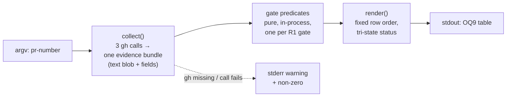

Model/effort: Claude Opus, high reasoning effort, Architect role.

# Architect report — technical decomposition and effort for W1

> **Status: proposed, not final.** This is an Architect-role artifact from the same
> pre-decision co-thinking step as `PRODUCT-REPORT.md` (`PRD-MULTI-AGENT-WIP.md` §3.5,
> Decision 5, A6), written into `wip/multi-agent-rollout/` and not into any accepted
> document. Per A7 this is explicitly the "proposed, deviations marked" framing: everywhere
> my technical judgment departs from what Product's report assumed or implied is marked
> **[DEVIATION]**, and things I consider genuine defects rather than preference differences
> are collected separately in §7 and marked **[DEFECT]**.
>
> Scoped input treated as a **floor** (A8). Beyond the named files I read, to settle
> technical questions the named set could not: `test/lib.sh` (`fake_gh_bin`,
> `path_without_gh`, sandbox), `test/run.sh`, `test/cases/s130_model_record_gate.sh`,
> `skills/pre-merge-review/model-record-gate.sh`, `hooks/git-guardrails`,
> `check-scenario-file-sync.sh`, `check` (its wiring blocks), `skills/check-convention/
> SKILL.md`, `vendor/codebase-design/DEEPENING.md`, and the **live** GitHub state of issue
> #265 / PR #279 (`gh pr view 279 --json …`, `gh pr checks 279`, `gh issue view 265`). Every
> claim about marker formats and PR fields below is a fact I verified against live data, not
> an assumption. Each is cited where used.
>
> I do not re-litigate Product's business case or priority call (their Q1, Q2, Q8). Where a
> technical fact bears on one of those, I say so and leave the decision with Product/Ties.

---

## 0. What I verified about #265 / PR #279 before designing anything

Because AC1 anchors the whole work item to this one PR, I checked what evidence actually
exists there today rather than trusting PRD §6's prose:

| Fact | Value (verified 2026-09-26) |
|---|---|
| PR #279 state | `MERGED`, `mergedAt` 2026-09-20T17:31:36Z |
| `headRefOid` | `6e00a8c38bf18f19cd53084b5c77ae476c1e74e6` — still resolvable via the API **after** `--delete-branch` |
| `closingIssuesReferences` | `[265]` (exactly one) |
| `gh pr checks 279 --json name,state,bucket` | `[{"bucket":"pass","name":"check","state":"SUCCESS"}]` — one check, still queryable post-merge |
| model-record markers | Five, **all on the PR** (body + comments): `stage=Discovery/Planning/Test/Implementation` (`model="claude-sonnet-5" effort="medium"`) and two `stage=Review` markers, both carrying a non-empty `same-model-exception="…"` |
| `pre-merge-review:done` markers | Two: `sha=472bc8f57…` (round 1, stale) and `sha=6e00a8c38…` (round 2, **equals** `headRefOid`) |
| Issue #265's own comments | **Zero HTML-comment markers of any kind** |

Three consequences fall straight out of that table, and they shape the design more than
anything in the PRD does:

1. **All machine-readable evidence hangs off the PR, not the issue.** Issue #265 carries
   none. Contrary to the general expectation in `model-record-gate.sh`'s header ("Discovery
   is typically recorded on the issue"), in the one work item W1 must reproduce, Discovery
   is on the PR too.
2. **The evidence survives merge and branch deletion.** `headRefOid` and the check runs are
   still there. W1 is buildable against real, durable data — this was my main
   is-it-even-possible risk and it is closed.
3. **Multiple rounds means multiple markers.** The collector must resolve "which marker
   counts" exactly as `model-record-gate.sh` had to (and got wrong twice, fixed in PR #253's
   review: `tail -1`, not `head -1`).

---

## 1. Module decomposition

### Answer

**One deep module.** A single executable whose Interface is:

```
compliance-evidence.sh <pr-number>   →   the OQ9 Gate/Status/Evidence table on stdout
```

and whose Interface (in the `codebase-design` sense — everything a caller must know, not
just the argv shape) is:

- **Input:** one PR number. Nothing else. No flags in v1.
- **Output:** a Markdown table on stdout, one row per R1 gate, in the fixed R1 order, with
  a three-valued Status vocabulary (evidenced / not-evidenced / unverifiable-from-artifacts).
- **Error modes:** exit 0 whenever a table was produced, *including* when rows are
  not-evidenced (AC3 — a partial report is the honest output). Exit non-zero only when no
  table could be produced at all: bad usage, or `gh` missing/failing such that nothing is
  known. Diagnostics to stderr, never interleaved into the table.
- **Invariants:** read-only (AC5); never asserts a status without naming an artifact (R2/AC2);
  never promotes an inference to a pass (see §5).
- **Performance/quota:** exactly three `gh` invocations for the normal one-closing-issue case.

Internally it has exactly two stages, and they are **internal seams**, deliberately not
exposed at the Interface:



`collect()` does all the I/O once and hands down one immutable bundle; every gate is then a
pure function of that bundle (DEEPENING category 1, "in-process" — always deepenable, no
adapter needed); `render()` knows the row order and the status vocabulary. That is depth:
a caller learns one argv and one output shape, and gets six gates' worth of marker-format
knowledge, round-resolution rules, `gh` failure policy and tri-state semantics behind it.

### The deletion test, applied for real

Suppose we split it three ways as the task suggests: a "read a marker comment" module, a
"read a CI check" module, and a "render the table" module, each its own script.

What happens to the complexity? It **relocates, and grows.** Whoever composes them must
then know, at the call site: the canonical gate list and its order (R1 — currently knowable
in one place); the tri-state vocabulary and which module may emit which value; that the
marker reader must be called once per marker family with different strictness (see §5);
that the CI reader's `bucket` and `state` fields disagree across this repo's own existing
usages; that a failed `gh` call must degrade to "couldn't check" rather than "absent" (the
exact false-negative bug PR #249's review found in `model-record-gate.sh`); and that the
three modules must share *one* fetch so we don't re-issue `gh pr view` three times — which
is precisely the duplicate-`gh`-calls finding PR #279's own round-1 review raised against
`wait-for-ci.sh`. All of that would have to be re-known by every caller, and there is
**exactly one caller**. Complexity does not vanish; it becomes an unwritten protocol between
three shallow modules.

So: the split fails the deletion test. Delete the three-way split and complexity disappears
into one implementation; delete the single module and it reappears at its one call site,
which is the definition of a module that earns its keep.

**The one decomposition I would accept later, and not now:** if a *second* consumer appears
(say W4's orchestrator wants gate statuses as JSON to post, not a rendered table), the
natural seam is between the bundle-plus-predicates and `render()` — an `--json` flag on the
same module, not a second script. Still one Module; a second output adapter behind the same
Interface.

### [DEVIATION 1] — the Interface takes a PR number, not an issue number

Product's JTBD says "given a work item's issue number". I recommend **PR number**, for three
reasons: (a) every piece of machine-readable evidence lives on the PR (§0), and issue #265
has none; (b) issue→PR resolution is an extra fallible lookup and is genuinely ambiguous
(nothing stops two PRs referencing one issue), whereas PR→issue is a single authoritative
field, `closingIssuesReferences`, which the merge guard and `model-record-gate.sh` already
treat as the source of truth; (c) it matches this repo's existing idiom exactly —
`wait-for-ci.sh <pr-number>`, `model-record-gate.sh <pr-number>`,
`finding-carryforward-gate.sh`, `issue-structure-gate.sh`. Product's *intent* (one work
item's evidence) is unchanged; only the handle changes. If Ties wants issue-number entry
later, it is a thin front door on the same module, not a different design.

---

## 2. The GitHub-access seam (Product's R5)

### Answer: the seam already exists, it is the `gh` executable on `PATH`, and W1 should add nothing

`gh` is a DEEPENING **category 4** dependency (true external — GitHub, which we don't
control). The category's prescription is an injected port with a mock adapter in tests. This
repo has already implemented exactly that, at the **process boundary** rather than in-source:

- **Adapter 1 (production):** the real `gh` binary.
- **Adapter 2 (test):** `test/lib.sh`'s `fake_gh_bin`, which writes a `gh` script into the
  sandbox and puts it first on `PATH`. `test/cases/s130_model_record_gate.sh` drives eleven
  distinct scenarios through it — complete markers, partial markers, a failing per-issue
  lookup, markers in the body, same-model, stale rounds, unquoted markers — all offline.
- **Adapter 3, also real:** `path_without_gh` (no `gh` at all), used to test the fail-open
  path. That helper exists because the naive PATH-exclusion trick worked locally and *not*
  on the GitHub Actions runner — a real portability lesson recorded in PR #279's own
  round-2 comment.

So the two-adapters rule is **already satisfied, with zero new code**. Two real adapters
exist, they vary for a real reason, and QA can test AC1-AC4 offline today by writing a
`fake_gh_bin` body whose `case "$*"` arms answer the three calls the collector makes. That
is AC6, achieved by using the repo's existing seam rather than by building one.

### What I am explicitly rejecting

- **A per-evidence-source seam** (a marker port, a CI port, a PR-field port). Each would have
  exactly one adapter — the same `gh` — so each is a hypothetical seam: pure indirection.
  Five of them would be five times the indirection for zero variation.
- **An in-source injection seam** (`GH_CMD="${GH_CMD:-gh}"`, or a `gh_call()` function tests
  override). One adapter, and worse: it invites tests to call `gh_call()` directly, i.e. to
  test *past* the Interface. The collector's Interface is argv → stdout; that is where the
  tests belong, because the interface is the test surface.
- **A fixture-file mode** (`--fixture-dir`). It would add a production-visible flag whose
  only consumer is the test suite — a test-only branch in shipped code, which the PATH stub
  makes unnecessary.

### [DEVIATION 2] — R5 as written invites a seam that should not be built

R5 says "its GitHub access sits behind a seam so the tests run without network", and
explicitly defers placement to Architect/QA. My placement answer is "at a seam that already
exists, outside the script" — which means the correct implementation of R5 is to write *no*
abstraction. I flag this because R5's phrasing reads as a build instruction, and a
Fullstack Developer who reads it that way will produce the one-adapter indirection above.
Worth restating in the issue as: *"tested through the existing `fake_gh_bin` PATH seam; no
in-script indirection."*

### One seam-adjacent constraint that is a requirement, not a preference

`collect()` must issue **one** `gh pr view` with all needed fields at once
(`--json body,comments,closingIssuesReferences,headRefOid,mergedAt,mergedBy,state`), one
`gh pr checks --json name,state,bucket`, and one `gh issue view --json comments` per closing
issue. Both the duplicate-call rule and the single-source-of-truth rationale are already
settled precedent in this repo (`wait-for-ci.sh` lines 59-63, from PR #279's review). It
also keeps the fixture small, since each `case "$*"` arm in the fake `gh` must match one
invocation exactly.

---

## 3. Language and tooling

**Bash 3.2, `set -uo pipefail`, no `eval`** — the repo's unambiguous idiom. Checked, not
assumed: `check-traceability.sh`, `wait-for-ci.sh`, `model-record-gate.sh`,
`check-scenario-file-sync.sh` and `hooks/git-guardrails` are all Bash with an explicit
"Bash 3.2-compatible: no `declare -A`, no `mapfile`, no `${var,,}`" header note, all
`set -uo pipefail`, all carrying a "no `eval`: this reads text not under its own control"
rationale where they parse GitHub text. W1 parses PR comment bodies, so that rationale
applies verbatim.

Concrete constraints the implementation inherits (each mechanically enforced here):

- **No `producer | grep -q`.** Use here-strings (`grep -q … <<<"$text"`). `check-no-sigpipe-race.sh`
  runs in `./check` and will fail the build otherwise; issue #218 is the history.
- **`check-no-quote-break.sh`** and shellcheck both run from `./check`.
- **jq via `gh --jq`**, not a standalone `jq` dependency — `gh` bundles it and every existing
  gate uses `--jq`. Adding a `jq` binary dependency would be a genuinely new dependency and
  would contradict `ARCHITECTURE-MULTI-AGENT-WIP.md`'s "None new."
- **`python3` only if forced.** Precedent exists (`hooks/git-guardrails` embeds a python3
  snippet for the marker/sha comparison and the stray-`Closes` analysis), so it is available
  and idiomatic *when* structured traversal is genuinely needed. My judgment: it is not
  needed here — `gh --jq` flattens the JSON, and the remaining work is `grep -oE` over text,
  exactly like `model-record-gate.sh`. Recommend plain Bash; if a reviewer finds the
  render logic getting knotty, python3 is the sanctioned escape hatch, not a new language.
- **Table rendering** is `printf` of a fixed header plus one `printf` per row. No templating.

**Test harness:** one file `test/cases/sNNN_compliance_evidence.sh`, sourcing `test/lib.sh`,
using `sandbox_create` / `trap sandbox_destroy EXIT` / `fake_gh_bin` / `path_without_gh` /
`assert_contains` / `fail` / `test_done`, run in parallel by `test/run.sh`, which `./check`
invokes. Next free scenario number is **S150** (highest current heading is S149; the number
must be reserved in `TEST-SCENARIOS.md` *and* named in the test file's header comment line,
or `check-scenario-file-sync.sh` fails — that check exists because two work items already
collided on a scenario number).

---

## 4. Effort estimate

**Size: M (small M).** Concretely, for the implementation-and-tests share:

| Part | Estimate |
|---|---|
| `compliance-evidence.sh` (≈150-200 lines incl. the rationale comments this repo writes) | 2-3 h |
| `test/cases/s150_*.sh` with the #279 fixture + missing-gate + unverifiable + no-`gh` + gh-failure cases | 2-3 h |
| `TEST-SCENARIOS.md` entry, `Covers:` wiring, `check-scenario-file-sync.sh` reconciliation | 0.5-1 h |
| Review rounds (this repo averages two) | 1-2 h |
| **Total, code side** | **≈6-9 h** |

Calibration, not guesswork: the closest comparable already in the repo is #265/PR #279
itself — `wait-for-ci.sh`, 117 lines, one test case, two review rounds. W1 is somewhat
larger (six gates, three `gh` calls, a tri-state vocabulary) and its fixture is bigger.

**Explicitly excluded from that number:** the five-role pipeline overhead. Product's own
risk table flags that full five-role engagement on a small script is heavy and that this is
deliberate (issue #281). Realistically the pipeline ceremony will cost *more* wall-clock
than the code. I am not estimating it, because measuring it **is** the pilot's output —
putting a number on it up front would prejudge the very thing OQ11 needs evidence for.

### What would make it bigger than it looks

1. **AC1 as currently written cannot be met** (§7, D1). Renegotiating its wording costs a
   round trip through Product and possibly Ties before implementation can start. This is the
   single largest schedule risk in the item, and it is a specification risk, not a code risk.
2. **The `Covers:` / `PRD.md` contradiction** (§7, D3) — same shape: a blocking answer needed
   from Product/Ties, not work.
3. **Fixture fidelity.** A faithful #279 fixture must carry five model-record markers, two
   `pre-merge-review:done` markers with different shas, a `headRefOid`, a `closingIssuesReferences`
   of `[265]`, a checks answer, and an *empty* issue-comments answer. That is a large
   `fake_gh_bin` body; getting each `case "$*"` arm to match the collector's exact
   invocation string is fiddly, and every change to the collector's `--json` field list
   breaks every arm. Budget for one iteration purely on fixture/argv drift.
4. **The tri-state vocabulary leaking into exit semantics.** Deciding once — "exit 0 whenever
   a table was produced" — is cheap. Discovering it late, after `./check` or a caller has
   been wired to the exit code, is not.
5. **Renders in a GitHub comment, not just a terminal.** The output's real destination is an
   issue comment (OQ9). Pipe characters inside evidence text, and the `|` in a quoted marker,
   will break Markdown table cells. Cheap to handle deliberately, annoying to discover after
   the first real post.

---

## 5. Technical risks Product's report did not (or could not) see

### R-A — The two marker families have *different* strictness conventions, in the same repo

Verified in source:

- `hooks/git-guardrails` matches the review marker with a python regex requiring **exact**
  single spaces and exactly 40 hex chars:
  `<!-- pre-merge-review:done sha=([0-9a-fA-F]{40}) -->`
- `model-record-gate.sh` matches the model marker **tolerantly**:
  `model-record:[[:space:]]*stage=$stage\b`, with the value extraction trusting only the
  quoted `model="…"` form and *deliberately* going silent (rather than guessing) on the
  unquoted form.

A collector that uses the tolerant regex will report markers the merge guard would reject,
and vice versa. Neither choice is wrong, but silently picking one makes the report disagree
with the gate it claims to evidence. **Recommendation:** match tolerantly (a reporter's job
is to show what is there), and render a *distinct* note when a marker is present but not in
the guard-recognised shape. That is more informative than either extreme and costs one
extra branch.

### R-B — "Which marker counts" is a settled-but-subtle rule the collector must re-implement

PR #279 carries two `pre-merge-review:done` markers, the stale one first. `model-record-gate.sh`
learned the same lesson twice under review (PR #253: `tail -1` not `head -1`; and the
issue→description→comments ordering, because issue text concatenated last let a stray older
marker outrank a newer one). The collector inherits both bugs by default if written naively.
For the review-marker gate specifically there is a better rule available than "last one
wins": compare each marker's sha against `headRefOid` — that is what the merge guard does
(issue #225), and on #279 it resolves cleanly to the round-2 marker. Use it.

### R-C — `gh pr checks` field instability is already observable inside this repo

`wait-for-ci.sh` reads `--json name,state` and enumerates terminal states by hand;
`hooks/git-guardrails` reads `--json bucket,name`. Two scripts in one repo relying on two
different shapes of the same answer is a live signal that this surface moves. **Recommendation:**
request `name,state,bucket`, treat `bucket` as primary (it is the coarse, stable one) and
`state` as detail, and treat an *unrecognised* value as "couldn't determine", never as pass.

### R-D — Evidence decays; the AC1 anchor will not stay reproducible forever

Check-run conclusions and comments persist far longer than Actions logs (90-day default),
and `headRefOid` survived `--delete-branch` here — but this is GitHub retention policy, not
a contract. A live-data AC1 would therefore be a test that silently rots. This is a second,
independent reason AC6's offline requirement is load-bearing rather than merely convenient:
the fixture *is* the durable record of what #279 looked like. Recommend the fixture carry a
header comment saying it is a recording of #279 as of a stated date, and recommend one
manual live run against #279 during the work item, compared to the fixture by eye, recorded
in the PR. That manual comparison is the only honest way to claim the fixture is faithful,
and it must be labelled as a manual verification step, not automated.

### R-E — Rate limits are a non-issue; authentication in CI is the real constraint

Three calls per run against an authenticated `gh` is nowhere near any limit. The genuine
constraint is that CI has no credentials for a private repo, so any live-API test would fail
in CI, not be slow. AC6 is correct; I am only noting that its rationale is access, not speed.

### R-F — AC4 is harder than it reads, but not for the reason it sounds like

Rendering a third status is trivial. The three hard parts:

1. **There is adjacent evidence that will tempt a false pass.** `mergedBy` and `mergedAt`
   exist on the PR (verified). "TiesL merged it" is *not* "Ties confirmed before the merge,
   per A2" — A2's confirmation is a pre-merge conversational act. The collector must cite
   `mergedBy` as context at most, and must never let it flip the row to evidenced. Say this
   in the issue explicitly; it is exactly the kind of near-miss inference an implementer
   makes in good faith.
2. **The second tempting inference is worse: "it merged, therefore the guard passed."** It
   does not follow. `hooks/git-guardrails` **fails open** on every `gh` error by design, and
   it carries an explicit skip path that prints *"warning: the merge guard … is explicitly
   skipped for this command."* A merged PR is therefore compatible with no marker and red CI.
   The collector must derive nothing from merge state.
3. **The status is a property of the gate, not of the work item.** The merge-confirmation
   row is unverifiable-from-artifacts for *every* work item, forever, by design — not
   because this one lacks evidence. That means the reason string is a constant attached to
   the gate definition, and the tri-state is structural, not data-driven. Getting that
   backwards (computing "unverifiable" from absent data) collapses AC4 into AC3 and makes a
   genuinely-missing marker indistinguishable from a gate that can never be evidenced —
   which is exactly the distinction R3 exists to preserve.

### R-G — AC5 ("read-only, asserted by a test") is testable here; the how is worth pinning down

Asserting a negative sounds unfalsifiable, but this repo already has both halves of the
technique: (a) a `fake_gh_bin` whose `case` arms answer the three read calls and whose
fallthrough `exit 1`s loudly on anything else — any write subcommand makes the test fail
noisily; strengthen it by having the fallthrough also append to a witness file the test then
asserts is empty; (b) a source-level grep assertion in the style of `check-no-sigpipe-race.sh` /
`check-no-quote-break.sh`, checking the script contains no `gh …` write subcommand
(`pr merge`, `pr comment`, `issue comment`, `issue edit`, `pr edit`, `label`, `api -X`,
`api --method`). Both together is proportionate. Neither alone is: (a) misses a write the
test never triggers, (b) misses one built by string concatenation.

---

## 6. Product's Q3 and Q4, from the technical angle

### Q3 — does a script actually fit "no new mechanism"? — **Agree with Product (yes), with a sharpening**

Product's argument rests on `wait-for-ci.sh` as precedent. I agree with the conclusion, and
would strengthen it on two technical grounds Product did not use:

1. **Literally zero new dependencies.** `ARCHITECTURE-MULTI-AGENT-WIP.md`'s "None new" is a
   claim about *dependencies*, and the collector adds none: Bash and `gh` are already hard
   requirements of `hooks/git-guardrails`, `wait-for-ci.sh` and three gate scripts. The
   "no new mechanism" worry is therefore not triggered in the sense the architecture
   document actually states it.
2. **The repo already has reporters, not only gates.** `pending-changes.sh` and
   `find-shared-vocabulary.sh` are read-only, human-invoked, produce text, and gate nothing.
   The collector is that category. So the precedent is broader than the single `wait-for-ci.sh`
   data point Product cited, which makes the answer less of a judgment call than Product's
   framing suggests.

What *would* violate "no new mechanism" — and W1 must not drift into — is a state file, a
cache, a config file, a second report format, or any write path. R4/§7 already rule those
out; I am confirming that the line Product drew is the technically correct one.

### Q4 — does the file location depend on dogfood-only vs shipped? — **Agree with Product's answer (dogfood-only), and yes, it binds W1's location, not only W2's**

Product wrote "(This affects where W2's files live — Architect's call once you answer.)"
It affects **W1's** location too, for a reason worth making explicit:

- `adopt.sh`'s `install_skills()` globs `skills/`. `skills/pre-merge-review/` already ships
  `model-record-gate.sh`, `finding-carryforward-gate.sh` and `issue-structure-gate.sh` to
  every adopted project through that glob. So the *most natural-looking* home for a new
  gh-dependent script — next to the other gh-dependent scripts — is precisely the one that
  silently ships it everywhere. Dogfood-only therefore rules `skills/**` out.
- `templates/` is the other shipping channel, and it is enforced: `check` contains explicit
  sync blocks that `diff -u templates/check-traceability.sh` and
  `diff -u templates/wait-for-ci.sh` against their root twins and fail on drift. Placing the
  collector in `templates/` means committing to that twin plus a new `check` block.

**Recommendation:** repo root, `compliance-evidence.sh`, **no** `templates/` twin, **no**
`check` sync block, **no** `CHANGES.md` row — matching Product's Q4 answer exactly. When the
epic ends and Ties decides to propagate, shipping it is three mechanical additions (twin,
sync block, `CHANGES.md` row via `adoption-registry`), none of which require a redesign.
That is the concrete, reversible-at-low-cost content of "dogfood-only", and it is why I
consider Product's recommendation technically right rather than merely cautious.

---

## 7. Defects in Product's report

Flagged as defects, i.e. things I believe are wrong or mechanically impossible as written —
distinct from the deviations in §1-§2, which are ordinary technical elaboration.

### [DEFECT D1] — AC1 is unachievable as written, and it is the item's load-bearing acceptance criterion

AC1 requires that "each row's evidence **matches what PRD §6's hand-written example
recorded** for that same work item." I read PRD §6's table against the live data. Its
Evidence cells are not artifact references; they are human-authored judgments *about*
artifacts. Verbatim (translated from the Dutch source):

- Row 3: *"pre-merge-review round 1 (**2 findings**: missing `CHANGES.md` row; duplicate `gh`
  calls + untested zero-checks case) and round 2 (both resolved, marker
  `pre-merge-review:done sha=…` on the last commit)"* — a count and a content summary of
  findings, plus a claim that they were resolved. No API field carries any of that.
- Row 2: *"Review marker with `same-model-exception` (**only available model in this
  session**)"* — the parenthetical is a paraphrase of free-text reasoning; the live marker's
  actual text is *"fork inherits the parent session's model; no other model was available to
  run this review"* (round 1) and a differently-worded variant (round 2). A collector can
  quote the marker; it cannot produce Product's paraphrase.
- Row 4: *"check-run linked to PR #279, **self-confirmed via `wait-for-ci.sh` — dogfooding of
  the delivered work itself**"* — a narrative fact about how the check was observed.
- Row 6: *"given before `gh pr merge`, per A2"* — conversational, by definition (which AC4
  itself acknowledges, contradicting AC1's demand that this row match).

So AC1 and AC4 conflict on row 6, and AC1 conflicts with reality on rows 2, 3 and 4. A
Fullstack Developer taking AC1 literally would either fail, or — worse and more likely —
hardcode the example's prose to make the test green, producing exactly the rubber-stamp
report R3 exists to prevent.

**Proposed repair (Product's to accept):** AC1 should assert **referential** identity, not
textual identity: *"it emits the same gate rows, in the same order, and each row cites the
same underlying artifact the hand-written example cites (the same markers, the same check
run, the same PR field) — the collector's cells may be terser than the hand-written prose,
and must not reproduce judgments the artifacts do not contain."* That keeps AC1's real
intent (reproduce the decided example, not a new interpretation) and makes it testable.
Bluntly: this repair also *strengthens* Product's case, because the gap between the
hand-written prose and what artifacts actually support is itself a finding about OQ9 — the
decided example quietly contains human narration, and a real OQ9 comment will therefore
always need a human sentence or two alongside the collector's table. That is worth knowing
before W4 posts one.

### [DEFECT D2] — R6/AC7's "wired per `check-convention`" is the wrong wiring, and `check-` would be the wrong name

R6 says "named and wired per `check-convention`"; AC7 says "reachable through the established
entry point … and `./check` passes." Three problems:

1. **`./check` is deliberately offline.** `check-traceability.sh`'s own header states it:
   *"Deliberately offline and without `gh`: … a check that needs network doesn't belong in a
   local `check`."* Every gh-dependent script in this repo is invoked from the
   `pre-merge-review` skill or from `hooks/git-guardrails` — **never** from `check`. I
   confirmed this by reading `check`'s wiring blocks: it runs `check-no-dutch.sh`,
   `check-no-sigpipe-race.sh`, `check-no-quote-break.sh`, the two `templates/` sync diffs,
   `check-traceability.sh`, `check-scenario-file-sync.sh`, the NFR/CHANGES library checks and
   `test/run.sh`. No `gh` anywhere.
2. **`check-convention` does not actually cover this case.** I read the skill: it is about
   the two fixed command names `check` and `deploy` and how CI calls `./check` without
   inventing its own checks. It says nothing about gh-dependent auxiliary scripts. Citing it
   as the naming/wiring authority for W1 points the implementer at a rule that does not
   address the situation.
3. **A `check-*` name would be a category error.** Everything named `check-*` here exits
   non-zero on a finding and is called by `./check`. The collector exits **0** with findings
   in its table (AC3). Naming it `check-compliance-evidence.sh` all but guarantees someone
   wires it into `./check` later and breaks CI the first time GitHub is unreachable.

**Proposed repair:** AC7 should read: the script is named without the `check-` prefix
(`compliance-evidence.sh`), is **not** invoked by `./check`; its *tests* are, via
`test/cases/s150_*.sh` → `test/run.sh` → `./check`; its scenarios are in `TEST-SCENARIOS.md`
with a resolving `Covers:` token; and `./check` passes. The precedent to cite is
`skills/pre-merge-review/*-gate.sh` (gh-dependent, fails open, invoked by a skill), not
`check-convention`.

### [DEFECT D3] — §7's "No edits to `PRD.md`" and R6's resolving `Covers:` token are mutually exclusive, mechanically

`check-traceability.sh` enforces link 1 in both directions:
`check_references "$scenarios" "TEST-SCENARIOS.md" "$prd_ids" "PRD.md"` reports any scenario
`Covers:` token that does not resolve to an ID heading in `PRD.md`, and the final loop
reports any PRD ID with no scenario covering it. The highest `F` heading in `PRD.md` today is
**F33**.

So a new scenario S150 carrying `**Covers:** F34` fails `./check` immediately unless
`PRD.md` gains an `F34` heading — which Product's non-goals forbid ("No edits to `PRD.md`,
`ARCHITECTURE.md`, `WORKFLOW.md` or `CHANGES.md`"). The only escape is to have S150 cover an
**existing** F-ID, which is workable but must be a deliberate, stated choice (and risks
mis-describing an existing functionality).

This is not a preference difference: as specified, AC7 and §7 cannot both be satisfied, and
`./check` — which AC7 itself requires to pass — is what proves it. **Proposed repair:**
Product/Ties decide one of: (a) W1 may add exactly one `F` heading to `PRD.md` (narrow,
stated exception to §7); (b) S150 covers a named existing F-ID, stated in the issue; or
(c) the new functionality is described in the WIP documents and `Covers:` points at an
existing ID with a note. I lean (a) — it is one heading, it is what the convention is for,
and the non-goal was aimed at premature promotion of the *design*, not at routine
traceability wiring. But it is Product's call, and it needs making before implementation.

### Not defects, recorded so they are not mistaken for oversights

- **AC5's "asserted by a test"** sounds unfalsifiable but is implementable here — see R-G. No
  change to the AC needed; the issue should just name the technique so QA and Fullstack
  Developer do not each invent one.
- **Product's exclusion of effort estimation** is correct per the role contract, and §4 above
  is my supply of that missing side. I note only that Product's §8 risk *"full five-role
  engagement on a small script is heavy"* is, on my numbers, an understatement: the ceremony
  plausibly exceeds the ~6-9 h of code. That is a fact bearing on Product's Q2/Q8 and it
  strengthens rather than weakens their case — a pilot whose overhead is visible is a better
  measurement of A3's cost than one where the work dwarfs the process. The priority call
  stays theirs.

---

## 8. Summary of the proposed design

| Decision | Answer |
|---|---|
| Module count | One deep Module. Internal seams (`collect` / gate predicates / `render`), never exposed. |
| Interface | `compliance-evidence.sh <pr-number>` → OQ9 table on stdout; exit 0 whenever a table was produced; diagnostics on stderr. |
| GitHub seam | Already exists: the `gh` executable on `PATH`. Two real adapters (`gh`, `fake_gh_bin`) plus `path_without_gh`. **Build nothing.** |
| `gh` calls | Exactly three for the normal case; all fields in one `gh pr view`. |
| Language | Bash 3.2, `set -uo pipefail`, no `eval`, here-strings not `producer \| grep -q`, `gh --jq` not standalone `jq`. |
| Location | Repo root, no `templates/` twin, not under `skills/` (dogfood-only — Q4). |
| Tests | `test/cases/s150_compliance_evidence.sh`, fixture-driven, offline, run by `./check` via `test/run.sh`. |
| Effort | **M** — ≈6-9 h of code and review, excluding five-role pipeline overhead (deliberately not estimated; measuring it is the pilot's output). |
| Blocking before implementation | D1 (AC1 rewrite), D3 (`Covers:`/`PRD.md`) — both need a Product/Ties answer, not work. |
